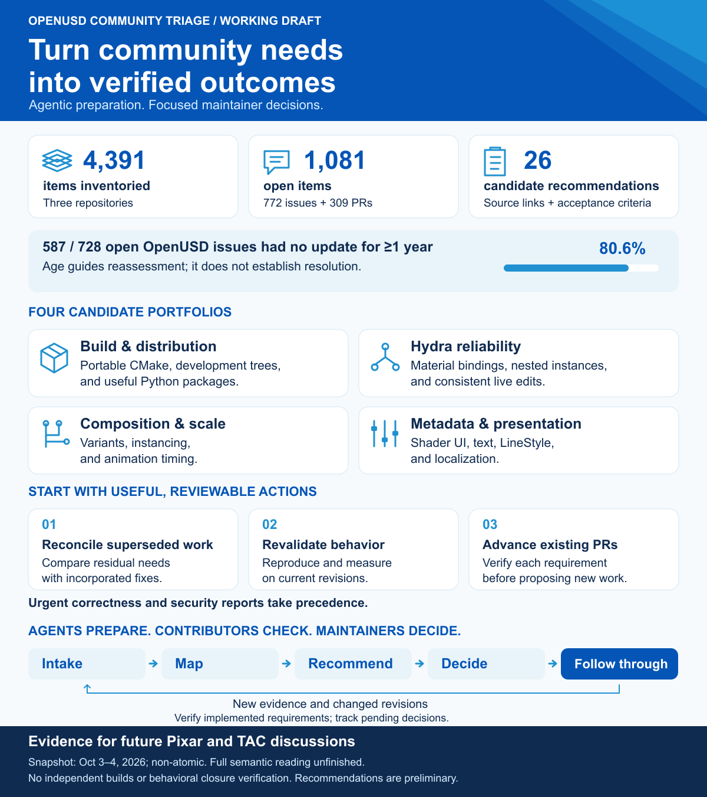
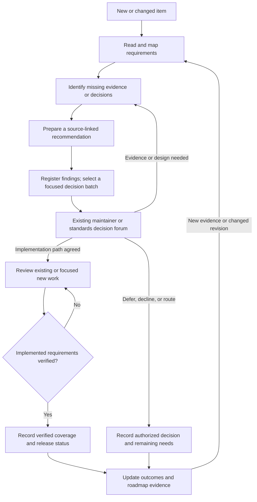

# Continuous Community Triage and Disposition for OpenUSD

**Status:** Working draft for future discussion with Pixar and the AOUSD Technical
Advisory Committee (TAC). Scope, participation, and review capacity remain to be agreed.

## Summary

Domain requirements are already generating issues, implementation pull requests,
and proposals across the USD ecosystem. Related discussions can develop separately,
making it difficult to see which requirements have been addressed, which decisions
remain open, and where existing work could satisfy additional needs.

This proposal would establish triage and follow-through built on three pillars:
agentic evidence preparation, contributor validation, and focused maintainer
decisions. Agents would pursue connected reading and analysis tasks, maintain
source-linked records, and prepare recommendations. Contributors would check those
records and assemble decision batches for existing decision makers. Requested
outcomes would remain traceable through design, implementation, verification, and release.
The intended outcomes are reliable behavior across tools and over time, and timely
progress from growing domain demand to deployed capabilities.

A living disposition register would make remaining requirements, decision
dependencies, and accepted next steps visible across the open inventory. An
illustrative six-week pilot would demonstrate the method on a bounded sample and
measure preparation throughput, evidence quality, and maintainer time. Those
measurements would show how the work could expand toward full coverage.

[View the full-size overview](assets/triage-overview.png) ·
[Editable SVG](assets/triage-overview.svg)

The overview summarizes the retained October 3–4, 2026 inventory and the candidate
portfolios below. Counts describe a non-atomic historical snapshot. Full semantic
reading is unfinished; no independent builds or behavioral closure verification
were performed. The 26 recommendations are preliminary.

**Navigate:** [Discussion path](#discussion-path) · [Workflow](#proposed-workflow) ·
[Agentic assistance](#agentic-assistance) ·
[Pilot](#pilot-and-acceptance-criteria) · [Review questions](#questions-for-review) ·
[Evidence](#appendix-initial-evidence-and-candidate-portfolios) ·
[Candidate register](#candidate-register)

## Problem Statement

Related requests are distributed across issue discussions, proposal reviews,
implementation pull requests, and ecosystem initiatives. A fix can supersede an
old pull request while its original discussion remains open. A published proposal
can leave implementation requirements unresolved. Similar reports can also describe
distinct failures requiring distinct tests. These relationships are difficult to
keep current through individual thread review.

The initial inventory collected October 3–4, 2026 contains 4,391 items across three
repositories, including 1,081 open items. Within OpenUSD, 587 of 728 open issues
(80.6%) had no update for at least one year. These observations motivate
reassessment; they do not establish that old reports are obsolete, that any item
is ready for closure, or why an item remains open. The inventory alone does not
measure the rate of growing demand or attribute delays to any participant.

## Goals

- Work toward a source-linked assessment of every open item, with explicit reading coverage and unresolved questions.
- Use agentic assistance to expand reading, relationship analysis, and continuing follow-through, with checked evidence and measured effort.
- Preserve distinct requirements when reconciling duplicates or superseded work.
- Identify existing and focused new changes with useful coverage of independent needs.
- Track proposal publication, implementation, verification, and release separately.
- Prepare traceable community-demand briefs for OpenUSD and appropriate AOUSD forums.
- Keep the historical inventory and incoming work current without losing review coverage.

## Scope and Decision Authority

Pixar/OpenUSD maintainers retain responsibility for implementation priorities,
architectural acceptance, integration, and release decisions. Repository actions
remain with the authorized maintainers of each repository. Triage contributors
prepare evidence and recommendations to support those existing processes.
A suggested reviewer or proposed action becomes an assignment only when accepted.

Questions involving specification requirements, interoperability, or dependencies
across groups would be raised through relevant existing proposal and AOUSD processes.
TAC could help coordinate questions spanning groups, subject to its mandate and
agreement to participate. Implementation capacity, adopted specification changes,
and roadmap dates remain decisions for the appropriate existing authorities.
The proposed discussion route should be checked against the
[AOUSD Working Group Processes](https://aousd.org/wp-content/uploads/sites/28/2025/05/AOUSD-Processes-Revision-v1.3-5.19.25.pdf)
and any subsequent revisions when engagement is proposed.

The historical inventory includes open and historical issues and PRs in
[OpenUSD](https://github.com/PixarAnimationStudios/OpenUSD) and
[OpenUSD-proposals](https://github.com/PixarAnimationStudios/OpenUSD-proposals).
[AOUSD Build IG initiatives](https://github.com/aousd/build-ig-initiatives) provide an
initial public coordination source. Additional sources can be included after their
scope and public availability are confirmed. GitHub demand is a partial view of
the community. The proposed records would be grounded in public evidence and
contributions authorized for publication.

## How the Work Can Scale

The proposed division of work is straightforward: agents and contributors prepare
evidence across the inventory, while maintainers receive selected questions that
need their judgment. Agents would carry out connected tasks from collection and
reading through relationship analysis and updates. Contributors check source links,
preserve distinct requirements, prepare reproductions or tests, and flag uncertainty
before a record enters a decision batch. Authoritative decisions remain with the
appropriate forum.

The retained census and 26 candidate recommendations demonstrate an initial step:
enumeration and connected evidence can yield a prepared queue. The pilot would
test the quality and cost of extending that preparation, including less obvious
relationships and longer discussions. Full semantic assessment and sustained
throughput remain work to demonstrate.

| Layer | Work prepared | Output for the next layer |
| --- | --- | --- |
| Agentic inventory and reading | Enumerate items and changed revisions; read connected evidence; expose coverage and gaps. | A complete list with visible preparation states and source-linked draft findings. |
| Contributor assessment | Check evidence, reconcile related work, retain distinct requirements, and prepare verification needs. | Checked recommendations with uncertainty and residual needs. |
| Focused decision batches | Select questions by impact, readiness, dependencies, and agreed review capacity. | A concise requested decision, supporting evidence, and links for deeper inspection. |
| Follow-through | Record accepted decisions; contributors update evidence, tests, remaining requirements, and release status. | Reusable knowledge and less repeated investigation. |

Each item can have a visible preparation state even while a decision is pending:
inventoried, evidence under review, recommendation prepared, awaiting decision,
decision recorded, or implemented outcome verified. These are community-record
states; a prepared entry does not imply official maintainer acknowledgment.

Batch size and cadence would fit an agreed review budget. Contributor findings
would remain in the register rather than generating a comment on every issue or
requiring a maintainer response to every entry. Each batch would foreground a few
decisions, what evidence supports them, and what work contributors can take on.
Broader coverage would improve visibility and candidate selection between batches.

The scalability claim should be demonstrated through growing coverage, checked
evidence, and lower maintainer effort per useful decision. Measure total preparation
and upkeep cost as well, so effort transferred to contributors remains visible.

### Agentic Assistance

Agentic assistance is a proposed operating pillar. An assistant would follow a
bounded research objective across issues, comments, proposal revisions, implementation
PRs, and tests; identify missing evidence; perform the next relevant read or check;
and update a persistent record. This goes beyond summarizing individual threads:
the useful output is a maintained account of requirements, relationships, candidate
coverage, and the next decision or verification needed.

| Agent task | Reviewable output |
| --- | --- |
| Read and reconcile | Requirements, prior decisions, contradictions, and gaps, linked to exact sources and reviewed revisions. |
| Connect existing work | Candidate relationships between reports, proposals, fixes, and releases; complete, partial, and possible coverage kept distinct. |
| Prepare focused actions | A requested decision, residual requirements, proposed reproduction or test plan, and dependencies. |
| Refresh affected findings | Changes since the last successful read, conclusions needing reassessment, and a resumable work queue. |
| Build demand evidence | Independent needs and recurring themes with source links, explicit denominators, and unresolved implementation or standards questions. |

Each record would distinguish retrieved evidence, an agent's inference, a
contributor's assessment, and an authorized decision. Source URLs, revisions,
retrieval checkpoints, and reading gaps would remain inspectable. A proposed
relationship is a hypothesis until its supporting evidence has been checked;
an implemented outcome requires appropriate verification. Agents could prepare
and, in agreed environments, execute reproduction or test tasks, preserving the
commands, revisions, and results for review.

Contributors would validate records selected for a decision batch and sample the
broader preparation queue to measure errors and missed relationships. Record
maintenance would be incremental: new evidence triggers review of affected claims
and linked candidates. External repository actions would remain a separately
authorized activity; preparation itself can progress across the full inventory.

The retained census and recommendation register are an initial demonstration of
agent-assisted preparation. The pilot would measure its accuracy, correction cost,
coverage, and upkeep under continuing changes. Agent activity or generated record
count alone would not establish progress; the test is whether checked preparation
helps contributors and maintainers reach useful outcomes with less repeated work.

## Discussion Path

The first discussion would present a prepared batch and ask Pixar/OpenUSD maintainers
to evaluate its usefulness within an agreed review budget. Agree on a manageable
sample, useful evidence, and a review format before starting.
The steward would prepare the records; participating reviewers would choose where
their expertise is needed and how much time they can contribute.

A subsequent TAC discussion could use those records to identify specification,
interoperability, and cross-group decisions that would benefit from coordination.
The ask would be to assess the relevant questions and dependencies, and determine
appropriate forums through existing processes.

| Discussion | Concrete ask | Useful output |
| --- | --- | --- |
| Pixar / OpenUSD maintainers | Can this prepared batch produce useful decisions within an agreed time budget? Which evidence or presentation changes would make it more useful? | A measured review exercise, evidence corrections, and any accepted next steps. |
| TAC, where relevant | Which recorded questions require coordination across implementation and standards work? | Appropriate decision forums, dependencies, and any accepted coordination next steps. |

## Definitions

| Term | Meaning |
| --- | --- |
| Disposition | An authorized decision, rationale, and any accepted next step; an item can remain open. |
| Recommendation | A proposed disposition or next action awaiting consideration by the relevant decision maker. |
| Independent requirement | A distinct requested outcome with its own acceptance criterion, even if several reports describe it. |
| Coverage | The relationship between a requirement and a candidate change: complete, partial, possible, or unrelated. |
| Verified resolution | Evidence that the reported behavior is satisfied on a specified revision and environment. |
| Roadmap signal | A sourced account of unmet needs and dependencies for consideration by a decision forum. |

## Proposed Workflow

Triage first identifies the decision or evidence needed to advance an item. A bug
report may need a reproduction; a proposal may need agreement on scope or behavior;
an implementation PR may need focused review or tests; a specification question
may need interpretation or revision. Contributors prepare a recommendation for
the existing decision forum, recording pending questions and accepted decisions separately.

Verification supports a claim that an implemented requirement is satisfied. It is
not a prerequisite for recording an unresolved design question or an authorized
decision to defer or decline.

### Inventory and Reading Coverage

Enumerate paginated collections and deduplicate by repository, item type, and
number. Record retrieval times and revisions rather than implying an atomic
snapshot. Read bodies, discussions, reviews, relevant changed files, and linked
evidence to the depth needed for each claim. Historical reading supplies prior
decisions, fixes, and rejected approaches; record unavailable or truncated content.

Keep separate states for inventoried, discussion read, implementation examined,
and behavior verified. Publish coverage denominators by repository, type, and state.
Useful bounded recommendations can be prepared while historical reading continues.

Incremental collection uses an overlap around its last successful watermark.
Advance the watermark after successful collection, deduplicate repeat events,
and periodically reconcile the open inventory. New evidence or revisions trigger
reassessment of findings they may invalidate.

### Disposition Record

Start with a Markdown register and a machine-readable export where useful.
Tooling should follow experience from the pilot. Reuse existing discussions and
link to supporting evidence so reviewers can focus on the requested decision.

| Field | Information to record |
| --- | --- |
| Identity | Canonical URL, repository, issue or PR number, current state, and reviewed revision/time. |
| Requirement | Requested outcome, affected workflow, environment, and known or proposed acceptance criteria. |
| Evidence | Supporting discussion, code, tests, prior decisions, and outstanding reading gaps. |
| Relationships | Duplicate of, supersedes, implements, partially addresses, or blocked by; evidence for each claim. |
| Recommendation | Proposed disposition or next action, rationale, confidence, and missing evidence. |
| Accountability | Proposed next action, accepted owner if any, known blockers, and appropriate revisit trigger. |
| Outcome | Authorized decision, verification result, implementation revision, and applicable release. |
| Roadmap | Theme, independent demand, decision needed, dependencies, and proposed forum. |

### Disposition Criteria

| Action | Minimum basis |
| --- | --- |
| Resolve | Match every retained requirement to a verified fix and applicable revision/environment. |
| Consolidate duplicate or superseded work | Identify the canonical record and preserve distinct requirements and evidence. |
| Advance an existing PR | Identify exact coverage, review blockers, missing tests, and integration dependencies. |
| Propose a new PR | Define focused scope, affected requirements, proposed tests, and dependencies. |
| Request information or a decision | Specify the missing reproduction, environment, measurement, or design question. |
| Defer or decline | Record the authorized rationale, alternative, and revisit trigger. |
| Route elsewhere | Record the proposed destination and whether the handoff is acknowledged; source-item disposition remains with its maintainers. |

Age, silence, a closure phrase in a PR, and a merged proposal are individually
insufficient evidence of resolution. Sensitive security reports follow the
repository's security reporting process. Pending decisions and ownership gaps
remain visible findings rather than blocking preparation of the register.

### Select Work with Useful Reach

List affected items and independent requirements separately. Review existing PRs
first and distinguish complete, partial, and speculative coverage. Deduplicate
requirements across a selected portfolio so overlapping candidates do not inflate
the claimed benefit. Shared tests can support several focused changes.

Rank candidates by severity, workflow impact, additional verified coverage,
readiness, confidence, effort, compatibility risk, and maintenance cost. Keep those
factors visible. Urgent correctness and security work can take precedence over
broad coverage. Split unrelated fixes even if combining them increases an apparent
closure count.

For example, [R13](#r13-hydra-material-parity) brings several Hydra material reports
into one review matrix while retaining separate requirements:

| Requirement to examine | Source | Verification or decision evidence needed |
| --- | --- | --- |
| Material-purpose behavior | [OpenUSD issue #3320](https://github.com/PixarAnimationStudios/OpenUSD/issues/3320) | Compare core binding resolution with scene-index outputs. |
| Collection binding | [Issue #3484](https://github.com/PixarAnimationStudios/OpenUSD/issues/3484) | Check preservation of collection semantics through the imaging path. |
| Nested instances | [Issue #3690](https://github.com/PixarAnimationStudios/OpenUSD/issues/3690) | Check binding results across instance/prototype boundaries. |
| Additional parity cases | [#4113](https://github.com/PixarAnimationStudios/OpenUSD/issues/4113), [#4122](https://github.com/PixarAnimationStudios/OpenUSD/issues/4122), [#4121](https://github.com/PixarAnimationStudios/OpenUSD/issues/4121) | Retain a separate acceptance test for each reported behavior. |

This is an illustrative matrix from the preliminary R13 record. Shared fixtures
may support distinct fixes; no combined resolution is established. A coordinated
review can identify shared infrastructure and missing coverage before new work is proposed.

### Community Demand and Roadmap Input

Each brief states the use case, linked evidence, independent requirements,
publicly evidenced participants, chronology, alternatives, compatibility implications,
dependencies, and suggested next milestone. Compare historical and recent demand
with explicit windows and denominators. Authors, comments, reactions, and duplicate
reports are distinct signals rather than interchangeable measures of demand.

Identify the requested decision and why the proposed forum is appropriate.
Distinguish implementation defects, specification ambiguities or defects, domain
requirements, and gaps in tests or supporting infrastructure. When implementation
and specification decisions interact, record the dependencies and decisions needed
from each. Build and distribution topics should reconcile existing public Build IG
initiatives and linked work.

An independently governed extension may also be an appropriate implementation path
where it builds on shared USD behavior. Make that option visible without presuming
every domain capability must enter OpenUSD's distribution or become an AOUSD standard.
Verify the relevant forum's charter before recommending a destination. TAC coordination
would be considered where questions span groups. A brief remains a recommendation.

## Pilot and Acceptance Criteria

The proposed pilot would begin after its steward and participating decision makers
agree on scope, review capacity, and how recommendations will be presented. The
steward would prepare evidence records and bounded review batches. Component
reviewers, proposal authors, and AOUSD contacts would participate where selected
items require their expertise.

Six weeks and 20–30 open items are illustrative planning choices for contributor
assessment. Only selected decision questions would enter maintainer review batches,
sized to an agreed time budget. The sample need not cover every candidate portfolio.
Proposed work remains unassigned until accepted; recommendations can remain pending.

| Period | Work | Reviewable output |
| --- | --- | --- |
| Weeks 1–2 | Refresh inventory; calibrate reading effort; prepare an agreed sample, including cross-repository relationships where relevant. | Coverage ledger, sample, source-linked requirements, and missing evidence. |
| Weeks 3–4 | Review existing PRs and historical fixes; validate candidate coverage with participating reviewers. | Bounded recommendation batch, decision questions, and focused verification needs. |
| Weeks 5–6 | Present recommendations; record accepted decisions and pending questions; prepare demand briefs where useful. | Outcome record, reviewer-effort assessment, and a continue/change/stop recommendation. |

Each selected item should have a source-linked account of its requirements, current
evidence, recommended next step, and unresolved questions. Accepted decisions and
assignments are recorded separately. Every claimed resolution requires verification
appropriate to that claim. A pending decision or ownership gap is a valid finding.
Where evidence permits, show how coordinated review can cover independent requirements
without enlarging unrelated changes.

Assess whether prepared records help participants reach clearer decisions, preserve
remaining requirements, and reduce repeated investigation. Measure maintainer and
contributor effort alongside coverage, evidence gaps, intake, review blockers,
verified needs, and revised findings. Track publication, implementation, and release
separately; closures alone are not success.

The pilot should publish a measured case for expansion:

| Measure | What it would demonstrate |
| --- | --- |
| Preparation throughput and coverage | How many items are assessed to the declared depth per contributor-hour, agent runtime and cost, and whether coverage grows relative to new intake. |
| Evidence quality | Corrections found during independent checks, unsupported agent claims, missed relationships, and retained residual requirements. |
| Maintainer review cost | Minutes per batch and per useful decision; where a comparable case is available, preparation and review time with and without a prepared record. |
| Reuse and upkeep | Related items served by reusable evidence or fixtures, and effort to refresh records after new comments or revisions. |

Use the observed rates to estimate the effort needed for wider coverage and the
decision throughput supported by the agreed review budget. Publish assumptions and
uncertainty, including difficult cases and any remaining bottleneck. A smaller
pilot demonstrates a method and supplies scaling estimates; it does not establish
that every case will be equally inexpensive.

Any continuation proposal would state participating capacity, maintenance
responsibilities, and the review cadence demonstrated to be useful during the pilot.
Historical reading can continue without requiring completion of the entire corpus
before a bounded batch is useful.

## Risks and Alternatives

| Risk | Mitigation |
| --- | --- |
| Premature closure from superficial matches | Per-requirement evidence and maintainer review; preserve residual needs. |
| Administrative burden | Agree a review time budget; keep broad preparation with contributors; measure preparation, correction, and maintainer review effort separately. |
| Record volume exceeds useful decision capacity | Make pending states visible, rank small decision batches, and measure intake against preparation and decision throughput. |
| Agent findings are inaccurate or lose important context | Preserve inspectable evidence and revisions; validate decision-batch records; audit broader coverage and measure correction effort. |
| Coverage incentives favor large PRs | Count marginal independent coverage and retain urgent single-item work. |
| Stale register or automated summaries | Revision tracking, periodic reconciliation, and explicit human review. |
| Demand overrepresented by vocal participants | Separate duplicates and independent needs; state GitHub participation limits. |
| Recommendations interpreted as authority or assignments | Record proposed and accepted actions separately; preserve existing decision processes. |

Ad hoc triage has low startup cost but leaves cross-repository relationships hard
to audit. Labels aid discovery while providing limited detail on partial coverage
or verification. Automated stale closure reduces item counts without establishing
outcomes. A dedicated service might eventually help; a document-based pilot can
first establish useful records and actual workload.

## Out of Scope

The proposal concerns review operations. It introduces no USD schema, file-format
change, runtime behavior, assigned roadmap dates, or new authority over repositories
and standards groups. Automatic closures and merges are outside its scope.
Automation may collect or suggest records; authorized participants decide actions.
Scene-representation examples are therefore unnecessary.

## Questions for Review

1. Does the prepared batch enable useful decisions within an agreed maintainer time budget?
2. What evidence, contributor support, and review format would improve that result?
3. What verification and release conditions should support a resolution claim?
4. Which questions could benefit from TAC coordination, and which existing forums should decide them?
5. What measured preparation rates, evidence quality, and upkeep costs would justify wider coverage, and where should continuing records live?

## References and Proposal Precedents

The structure follows the repository's
[proposal guidance](https://github.com/PixarAnimationStudios/OpenUSD-proposals/blob/main/README.md)
and [PR template](https://github.com/PixarAnimationStudios/OpenUSD-proposals/blob/main/.github/pull_request_template.md).
Recently accepted examples reviewed for the original draft include
[Authorship, PR #106](https://github.com/PixarAnimationStudios/OpenUSD-proposals/pull/106),
[Back Plate, PR #104](https://github.com/PixarAnimationStudios/OpenUSD-proposals/pull/104),
[LOD, PR #81](https://github.com/PixarAnimationStudios/OpenUSD-proposals/pull/81), and
[Alternate Libwork implementations, PR #86](https://github.com/PixarAnimationStudios/OpenUSD-proposals/pull/86).
Their useful patterns are clear motivation, explicit boundaries, concrete examples,
implementation considerations, and alternatives.

The overview uses blue colors and layered geometry inspired by
[AOUSD's public website](https://aousd.org/) and [media assets](https://aousd.org/media-assets/),
with clean sans-serif typography and original outline icons. It is an editable
illustration of this working proposal; the figures and candidate groupings are
qualified by the retained evidence below.
## Appendix: Initial Evidence and Candidate Portfolios

The following findings are from retained, non-atomic October 3–4, 2026 snapshots.
They are preliminary inputs to the pilot and should be refreshed before action.
Inventory is complete for those retained snapshots; full semantic reading is unfinished.
No independent OpenUSD builds or behavioral closure verification were performed.
No confirmed closure count is claimed.

| Repository | Inventoried items | Open issues | Open PRs |
| --- | ---: | ---: | ---: |
| OpenUSD | 4,224 | 728 | 283 |
| OpenUSD-proposals | 116 | 12 | 25 |
| AOUSD Build IG initiatives | 51 | 32 | 1 |
| Total | 4,391 | 772 | 309 |

Four candidate portfolios organize the reviewed evidence:

| Portfolio | Recurring needs | Pilot focus |
| --- | --- | --- |
| Build and distribution | Portable CMake, runnable development trees, useful Python packages. | Reconcile existing Build IG initiatives and implementation PRs. |
| Hydra reliability | Material binding, nested instances, consistent live edits. | Shared regression fixtures with distinct fixes and acceptance criteria. |
| Composition and scale | Variant performance, deterministic instancing, animation timing. | Remeasure older reports and review matching PRs. |
| Metadata and presentation | Portable shader UI, text, LineStyle, localization. | Separate representation needs from rendering and interoperability decisions. |

These are evidence-backed work groupings, not measured community-wide rankings.
Title screening was used for discovery and is not a validated demand classification.
Start with superseded-work reconciliation, revalidation of older behavior, and
existing evidence-ready PRs; urgent correctness or security reports take precedence.

## Candidate Register

Each record proposes a next action and the verification or decision evidence
needed to assess it. Suggested reviewers are roles for consideration; owners
and technical approaches remain unassigned until accepted. Recommendations should
be checked against current revisions before action. R01 concerns urgent correctness;
the numeric order of the remaining records is not a priority ranking.

### R01: Parser robustness

| Field | Preliminary recommendation |
| --- | --- |
| Sources | [OpenUSD issue #4215](https://github.com/PixarAnimationStudios/OpenUSD/issues/4215); [OpenUSD issue #4217](https://github.com/PixarAnimationStudios/OpenUSD/issues/4217); [OpenUSD issue #4218](https://github.com/PixarAnimationStudios/OpenUSD/issues/4218) |
| Proposed next action | Confirm stock-input reproduction and owner; use the repository security-advisory route for sensitive follow-up. Do not conflate harness-only and stock-input failures. |
| Verification criteria or decision evidence | Separate minimal stock-file reproduction, sanitizer evidence and affected revisions; regression per failure. |
| Suggested reviewer | Sdf parser maintainer |

### R02: Retyping PR reconciliation

| Field | Preliminary recommendation |
| --- | --- |
| Sources | [OpenUSD PR #4042](https://github.com/PixarAnimationStudios/OpenUSD/pull/4042); [OpenUSD issue #4040](https://github.com/PixarAnimationStudios/OpenUSD/issues/4040); [commit 7385066](https://github.com/PixarAnimationStudios/OpenUSD/commit/7385066a5847530903a1711375462c2a4f341478) |
| Proposed next action | Recommend closing or retargeting the PR after comparing residual scope with incorporated retyping logic. |
| Verification criteria or decision evidence | Confirm current behavior on the original TransferContent case; compare commit 7385066a and retained test coverage. |
| Suggested reviewer | UsdImaging maintainer / PR author |

### R03: Notice workaround reconciliation

| Field | Preliminary recommendation |
| --- | --- |
| Sources | [OpenUSD PR #3566](https://github.com/PixarAnimationStudios/OpenUSD/pull/3566); [OpenUSD issue #3563](https://github.com/PixarAnimationStudios/OpenUSD/issues/3563); [commit c7e64d1](https://github.com/PixarAnimationStudios/OpenUSD/commit/c7e64d1197ccfe8ae85b0b1da712fe575b51ad22) |
| Proposed next action | Recommend closing the old workaround if no residual requirement remains; retain atomic notification questions as a separate design topic. |
| Verification criteria or decision evidence | Replay the duplicate-instance case against batched-notice code and recorded regression; do not equate issue closure with a new notification API. |
| Suggested reviewer | UsdImaging maintainer / PR author |

### R04: Build policy tracker

| Field | Preliminary recommendation |
| --- | --- |
| Sources | [Build IG issue #38](https://github.com/aousd/build-ig-initiatives/issues/38); [Build IG PR #46](https://github.com/aousd/build-ig-initiatives/pull/46); [deprecation_strategy.md](https://github.com/aousd/build-ig-initiatives/blob/main/deprecation_strategy.md) |
| Proposed next action | Confirm that the published deprecation document satisfies the tracker; record the decision and close if complete. |
| Verification criteria or decision evidence | Published document and adopted scope match the initiative; preserve build-only applicability. |
| Suggested reviewer | Build IG initiative shepherd |

### R05: Build branch tracker

| Field | Preliminary recommendation |
| --- | --- |
| Sources | [Build IG issue #44](https://github.com/aousd/build-ig-initiatives/issues/44); [build-ig](https://github.com/PixarAnimationStudios/OpenUSD/tree/build-ig); [OpenUSD PR #4079](https://github.com/PixarAnimationStudios/OpenUSD/pull/4079) |
| Proposed next action | Update status to distinguish existing branch from remaining approval and workflow requirements. |
| Verification criteria or decision evidence | Branch ownership, contribution route and synchronization procedure recorded. |
| Suggested reviewer | Build IG shepherd / Pixar build maintainer |

### R06: Variant performance

| Field | Preliminary recommendation |
| --- | --- |
| Sources | [OpenUSD issue #1957](https://github.com/PixarAnimationStudios/OpenUSD/issues/1957); [OpenUSD issue #2010](https://github.com/PixarAnimationStudios/OpenUSD/issues/2010) |
| Proposed next action | Measure current performance before commissioning new work; retain residual selection and authoring costs separately. |
| Verification criteria or decision evidence | Replay both scaling cases on old and current revisions; record data and target interactive envelope. |
| Suggested reviewer | Composition performance maintainer |

### R07: Mixed-rate flattening

| Field | Preliminary recommendation |
| --- | --- |
| Sources | [OpenUSD PR #4258](https://github.com/PixarAnimationStudios/OpenUSD/pull/4258); [OpenUSD issue #3072](https://github.com/PixarAnimationStudios/OpenUSD/issues/3072) |
| Proposed next action | Review the focused production change and regression matrix; reconcile inherited fork-handoff wording with its current upstream location. |
| Verification criteria or decision evidence | References and payloads preserve times and values for basic, nested-offset and cancellation cases; independently verify CI. |
| Suggested reviewer | Composition / UsdUtils maintainer |

### R08: Shader diagnostics

| Field | Preliminary recommendation |
| --- | --- |
| Sources | [OpenUSD PR #4049](https://github.com/PixarAnimationStudios/OpenUSD/pull/4049); [OpenUSD issue #4048](https://github.com/PixarAnimationStudios/OpenUSD/issues/4048) |
| Proposed next action | Implement the requested debug control or separate failing-source accessor; preserve the normal compile-error channel. |
| Verification criteria or decision evidence | Exercise GL, Vulkan and Metal failures; generated-source line numbers match driver diagnostics; normal errors remain concise. |
| Suggested reviewer | Hgi maintainer / PR author |

### R09: Point-instancer bounds

| Field | Preliminary recommendation |
| --- | --- |
| Sources | [OpenUSD PR #3396](https://github.com/PixarAnimationStudios/OpenUSD/pull/3396); [OpenUSD issue #3395](https://github.com/PixarAnimationStudios/OpenUSD/issues/3395) |
| Proposed next action | Review traversal-predicate API and test coverage rather than write a competing bounds fix. |
| Verification criteria or decision evidence | Bounds work for prototypes under overs while default traversal, purpose, visibility and unloaded extents-hint behavior stay correct. |
| Suggested reviewer | UsdGeom maintainer |

### R10: Point-instancer IDs

| Field | Preliminary recommendation |
| --- | --- |
| Sources | [OpenUSD PR #3977](https://github.com/PixarAnimationStudios/OpenUSD/pull/3977); [OpenUSD issue #3976](https://github.com/PixarAnimationStudios/OpenUSD/issues/3976) |
| Proposed next action | Separate data-source exposure from renderer support; decide portable 64-bit representation. |
| Verification criteria or decision evidence | Authored primvars override automatic IDs; large and negative IDs work across supported delegates/backends. |
| Suggested reviewer | UsdImaging / Hgi / renderer maintainers |

### R11: Implicit sidedness

| Field | Preliminary recommendation |
| --- | --- |
| Sources | [OpenUSD PR #3689](https://github.com/PixarAnimationStudios/OpenUSD/pull/3689); [OpenUSD issue #3686](https://github.com/PixarAnimationStudios/OpenUSD/issues/3686) |
| Proposed next action | Add focused parity tests for implicit geometry and assess schema migration. |
| Verification criteria or decision evidence | doubleSided reaches render delegates; include cameras inside shapes and relevant transparent/CSG cases. |
| Suggested reviewer | Hydra schema maintainer |

### R12: Shader validation

| Field | Preliminary recommendation |
| --- | --- |
| Sources | [OpenUSD PR #4086](https://github.com/PixarAnimationStudios/OpenUSD/pull/4086); [OpenUSD issue #3957](https://github.com/PixarAnimationStudios/OpenUSD/issues/3957) |
| Proposed next action | Retain validator as partial implementation; separately cover documentation, CanConnect behavior and tests. |
| Verification criteria or decision evidence | Reject invalid sibling input wiring in validation and agreed query behavior; preserve valid container and sibling-output connections. |
| Suggested reviewer | UsdShade / validation maintainers |

### R13: Hydra material parity

| Field | Preliminary recommendation |
| --- | --- |
| Sources | [OpenUSD issue #3320](https://github.com/PixarAnimationStudios/OpenUSD/issues/3320); [OpenUSD issue #3484](https://github.com/PixarAnimationStudios/OpenUSD/issues/3484); [OpenUSD issue #3690](https://github.com/PixarAnimationStudios/OpenUSD/issues/3690); [OpenUSD issue #4113](https://github.com/PixarAnimationStudios/OpenUSD/issues/4113); [OpenUSD issue #4122](https://github.com/PixarAnimationStudios/OpenUSD/issues/4122); [OpenUSD issue #4121](https://github.com/PixarAnimationStudios/OpenUSD/issues/4121) |
| Proposed next action | Build one acceptance matrix, then propose small fixes per failure boundary. |
| Verification criteria or decision evidence | Compare core binding resolution with scene-index outputs across purpose, collection, nested instances, visibility and physical subsets. |
| Suggested reviewer | UsdImaging maintainer / requesting delegate authors |

### R14: Coordinate systems

| Field | Preliminary recommendation |
| --- | --- |
| Sources | [OpenUSD issue #4263](https://github.com/PixarAnimationStudios/OpenUSD/issues/4263); [OpenUSD issue #4264](https://github.com/PixarAnimationStudios/OpenUSD/issues/4264) |
| Proposed next action | Investigate propagation and notice consistency as separate fixes with a shared regression fixture. |
| Verification criteria or decision evidence | Instance prototypes retain binding; observer state agrees with GetPrim after adding binding, resync, removal and shared-target edits. |
| Suggested reviewer | UsdImaging / Hdsi maintainers |

### R15: Class encapsulation

| Field | Preliminary recommendation |
| --- | --- |
| Sources | [Proposal PR #94](https://github.com/PixarAnimationStudios/OpenUSD-proposals/pull/94); [OpenUSD issue #3201](https://github.com/PixarAnimationStudios/OpenUSD/issues/3201); [OpenUSD issue #3869](https://github.com/PixarAnimationStudios/OpenUSD/issues/3869); [OpenUSD issue #3751](https://github.com/PixarAnimationStudios/OpenUSD/issues/3751) |
| Proposed next action | Review composition design and legacy imaging symptoms separately; document migration compatibility. |
| Verification criteria or decision evidence | Repeated composition deterministic; internal/file references and session edits covered; no unsupported attribution of legacy imaging bugs to core. |
| Suggested reviewer | Composition maintainer / proposal shepherd |

### R16: Variant serialization

| Field | Preliminary recommendation |
| --- | --- |
| Sources | [OpenUSD issue #3822](https://github.com/PixarAnimationStudios/OpenUSD/issues/3822); [OpenUSD issue #3954](https://github.com/PixarAnimationStudios/OpenUSD/issues/3954) |
| Proposed next action | Create behavioral conformance examples and confirm specification interpretation before changing formats or validity rules. |
| Verification criteria or decision evidence | USDA/USDC/API round trips, grammar, conditional format bump and legacy behavior documented; resolve empty reference ambiguity. |
| Suggested reviewer | Core specification liaison / Sdf maintainer |

### R17: Portable shader UI

| Field | Preliminary recommendation |
| --- | --- |
| Sources | [OpenUSD issue #3575](https://github.com/PixarAnimationStudios/OpenUSD/issues/3575); [OpenUSD issue #4099](https://github.com/PixarAnimationStudios/OpenUSD/issues/4099); [Proposal PR #100](https://github.com/PixarAnimationStudios/OpenUSD-proposals/pull/100); [Proposal PR #118](https://github.com/PixarAnimationStudios/OpenUSD-proposals/pull/118) |
| Proposed next action | Identify the representation and interoperability decisions still needed; compare existing proposals against the retained requirements. |
| Verification criteria or decision evidence | Nested metadata survives; naming aliases are compatible; ordering, hints, categories and conditional visibility retained. |
| Suggested reviewer | Sdr maintainer / DCC and renderer authors |

### R18: Portable CMake

| Field | Preliminary recommendation |
| --- | --- |
| Sources | [OpenUSD PR #3918](https://github.com/PixarAnimationStudios/OpenUSD/pull/3918); [OpenUSD PR #3919](https://github.com/PixarAnimationStudios/OpenUSD/pull/3919); [OpenUSD PR #3920](https://github.com/PixarAnimationStudios/OpenUSD/pull/3920); [Build IG issue #15](https://github.com/aousd/build-ig-initiatives/issues/15); [Build IG issue #24](https://github.com/aousd/build-ig-initiatives/issues/24); [Build IG PR #50](https://github.com/aousd/build-ig-initiatives/pull/50) |
| Proposed next action | Review coordinated consumer tests and the open package migration plan; preserve unresolved compatibility scope. |
| Verification criteria or decision evidence | Minimal C++ consumer survives relocation and supported dependency variants; old and new package paths tested during transition. |
| Suggested reviewer | Build maintainer / Build IG champion |

### R19: Development workflow

| Field | Preliminary recommendation |
| --- | --- |
| Sources | [OpenUSD PR #4079](https://github.com/PixarAnimationStudios/OpenUSD/pull/4079); [OpenUSD PR #1984](https://github.com/PixarAnimationStudios/OpenUSD/pull/1984); [OpenUSD PR #4138](https://github.com/PixarAnimationStudios/OpenUSD/pull/4138); [Build IG issue #37](https://github.com/aousd/build-ig-initiatives/issues/37) |
| Proposed next action | Coordinate source headers, runnable build tree and tests, with separate installation/runtime contracts. |
| Verification criteria or decision evidence | Clean Windows/Linux/macOS build-tree tools and representative tests run without install; plugin/resources and DLL paths verified. |
| Suggested reviewer | Build / test maintainers |

### R20: Binary package contents

| Field | Preliminary recommendation |
| --- | --- |
| Sources | [Build IG issue #28](https://github.com/aousd/build-ig-initiatives/issues/28); [Build IG issue #30](https://github.com/aousd/build-ig-initiatives/issues/30); [Build IG issue #47](https://github.com/aousd/build-ig-initiatives/issues/47); [OpenUSD PR #4230](https://github.com/PixarAnimationStudios/OpenUSD/pull/4230); [OpenUSD issue #3114](https://github.com/PixarAnimationStudios/OpenUSD/issues/3114) |
| Proposed next action | Publish package/platform/content matrix; treat imports, subprocess tools, imaging and optional formats separately. |
| Verification criteria or decision evidence | Clean install, import and subprocess execution; declared CLI/imaging/format/platform support and ownership. |
| Suggested reviewer | Release / Python packaging maintainer |

### R21: LineStyle

| Field | Preliminary recommendation |
| --- | --- |
| Sources | [OpenUSD PR #3844](https://github.com/PixarAnimationStudios/OpenUSD/pull/3844); [OpenUSD PR #3857](https://github.com/PixarAnimationStudios/OpenUSD/pull/3857); [Proposal PR #60](https://github.com/PixarAnimationStudios/OpenUSD-proposals/pull/60); [Proposal issue #56](https://github.com/PixarAnimationStudios/OpenUSD-proposals/issues/56) |
| Proposed next action | Review shader dependency and feature requirement matrix together; preserve view-dependent architecture decisions. |
| Verification criteria or decision evidence | Caps, joins, patterns, width and multi-view expectations tested per requirement. |
| Suggested reviewer | Storm / schema maintainer / proposal shepherd |

### R22: Text schemas

| Field | Preliminary recommendation |
| --- | --- |
| Sources | [OpenUSD PR #3258](https://github.com/PixarAnimationStudios/OpenUSD/pull/3258); [OpenUSD PR #3259](https://github.com/PixarAnimationStudios/OpenUSD/pull/3259); [Proposal issue #40](https://github.com/PixarAnimationStudios/OpenUSD-proposals/issues/40); [Proposal issue #50](https://github.com/PixarAnimationStudios/OpenUSD-proposals/issues/50); [Proposal issue #57](https://github.com/PixarAnimationStudios/OpenUSD-proposals/issues/57) |
| Proposed next action | Evaluate whether SimpleText offers a useful first implementation step; make addressed and residual requirements explicit for both proposals. |
| Verification criteria or decision evidence | Schema generation, style binding, layout and text regression coverage; separate rendering and typography fidelity. |
| Suggested reviewer | Schema maintainer / text contributor |

### R23: Localization

| Field | Preliminary recommendation |
| --- | --- |
| Sources | [Proposal PR #78](https://github.com/PixarAnimationStudios/OpenUSD-proposals/pull/78) |
| Proposed next action | Align normative text and examples with accepted discussion direction. |
| Verification criteria or decision evidence | Dictionary catalogs, ancestor lookup, variant display names and layer composition semantics form one coherent draft. |
| Suggested reviewer | Proposal author / localization shepherd |

### R24: Spline archival behavior

| Field | Preliminary recommendation |
| --- | --- |
| Sources | [Proposal PR #115](https://github.com/PixarAnimationStudios/OpenUSD-proposals/pull/115) |
| Proposed next action | Resolve bake-on-read versus parse-and-ignore contradiction before implementation or removal planning. |
| Verification criteria or decision evidence | Old scene read, evaluation, resave and migration behavior defined across releases. |
| Suggested reviewer | Ts maintainer / proposal author |

### R25: Release/version API

| Field | Preliminary recommendation |
| --- | --- |
| Sources | [Proposal PR #113](https://github.com/PixarAnimationStudios/OpenUSD-proposals/pull/113); [Proposal PR #117](https://github.com/PixarAnimationStudios/OpenUSD-proposals/pull/117); [OpenUSD issue #3821](https://github.com/PixarAnimationStudios/OpenUSD/issues/3821) |
| Proposed next action | Define metadata accessible before Usd import and plugin registration, alongside release naming and ABI policy. |
| Verification criteria or decision evidence | Patch version available before plugin loading; existing version APIs retained; compatibility examples provided. |
| Suggested reviewer | Release / Python bindings maintainers |

### R26: Payload recomposition

| Field | Preliminary recommendation |
| --- | --- |
| Sources | [OpenUSD issue #2866](https://github.com/PixarAnimationStudios/OpenUSD/issues/2866) |
| Proposed next action | Check whether the offered patch exists elsewhere before requesting or drafting a competing change. |
| Verification criteria or decision evidence | Load rules and load set agree after downstream unload and forced recomposition. |
| Suggested reviewer | Composition maintainer / original contributor |

These 26 recommendations are a starting queue. Fresh revisions, reproductions,
and decisions may change their scope and priority.
