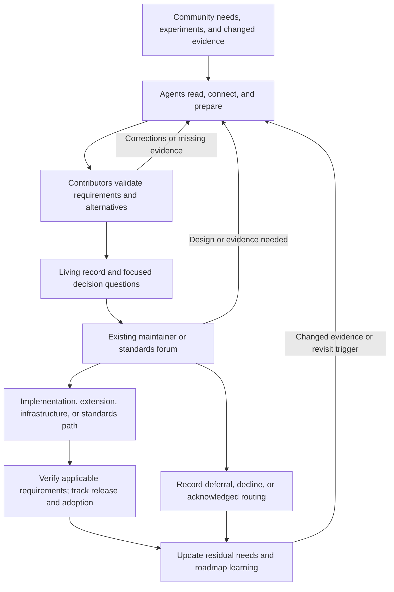
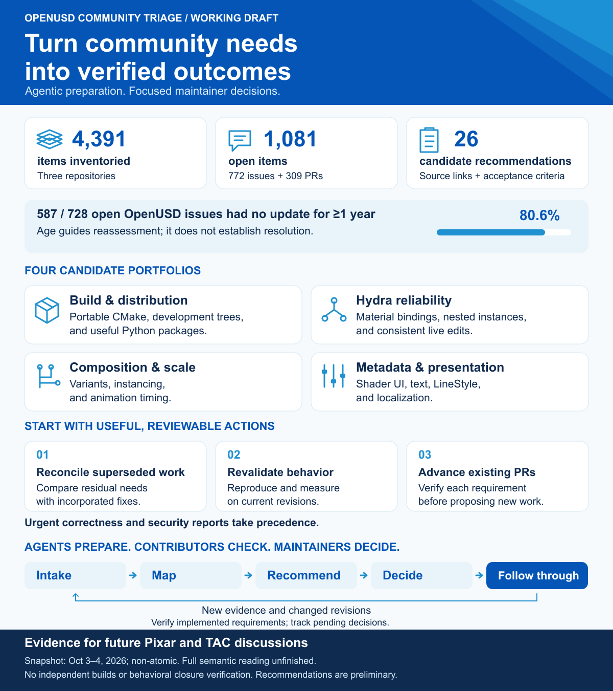

# Continuous Community Triage and Disposition for OpenUSD

**Status:** Working proposal for future discussion with Pixar/OpenUSD maintainers
and relevant AOUSD forums, including the Technical Advisory Committee (TAC).
Participation and operating responsibilities remain to be agreed.

## Summary

OpenUSD's continued evolution depends on turning community needs into reliable
capabilities that tools, content, and domain ecosystems can share. Those needs
emerge through practical use, experimentation, issue reports, proposals,
implementation contributions, and standards discussions. A credible path connects
them to an appropriate decision, an implementation or alternative, and evidence
that the intended outcome has been achieved.

This proposal establishes **continuous community triage and disposition as an
ecosystem capability**. It would preserve requirements and decision history across
venues, connect related contributions, expose unmet needs, and help domain
innovation progress toward adoption and shared standards where appropriate.
Repository reconciliation is one application of that capability.

Three pillars make the work scalable: **agents prepare, contributors validate,
maintainers and standards authorities decide**. Agents pursue connected reading
and analysis tasks and maintain source-linked records. Contributors check the
findings, develop reproducible evidence, and prepare focused questions. Existing
decision makers exercise their authority with a clearer view of requirements,
alternatives, dependencies, and remaining uncertainty.

The intended result is broader community coverage, better reuse of contributions,
focused expert decisions, and reliable follow-through. A living disposition record
would connect needs to accepted decisions, implementation, interoperability checks,
and release or adoption. Recorded deferrals and declines would also leave useful
rationale and revisit conditions. The benefits would be measured in operation.

[Full-size overview](assets/triage-overview.png) · [Editable SVG](assets/triage-overview.svg)

**Navigate:** [Strategic purpose](#problem-and-strategic-purpose) ·
[Operating model](#operating-model-and-agentic-assistance) ·
[Lessons from other communities](#lessons-from-other-communities) ·
[Workflow](#continuous-workflow) · [Measures](#measures-and-staged-adoption) ·
[Discussion path](#discussion-path) ·
[Initial evidence](#appendix-initial-evidence-and-candidate-portfolios) ·
[Candidate register](#candidate-register)

## Problem and Strategic Purpose

Community participation is effective when a contributor can understand how a need
will be assessed, which decision is required, and what evidence would move it
forward. Domain experts, implementers, and standards participants contribute
different parts of that evidence. Their work can span repositories, independent
extensions, working groups, tests, and deployed tools. A thread's local state gives
only part of the account.

The enduring challenge is continuity across that work. A promising experiment may
need wider interoperability evidence before shared agreement. A published proposal
can leave implementation work outstanding. An implementation may address only
part of a requirement, or lack release and adoption evidence. A deferred need can
become actionable when a dependency changes. Repeated investigation consumes
expert time when these relationships and prior rationales are not maintained.

Triage identifies the need, its evidence, and the next useful question. Disposition
records an authorized decision and rationale. Follow-through connects that decision
to action and outcome. Together they serve five strategic purposes:

| Purpose | Useful result |
| --- | --- |
| Community participation | A visible route for contributions, correction, and feedback, including pending needs and meaningful deferrals. |
| Domain innovation | Experiments and independently governed extensions can develop with an explicit relationship to shared USD behavior. |
| Interoperability | Compatibility questions and acceptance criteria remain traceable across implementations and standards work. |
| Effective stewardship | Experts receive checked evidence and precise questions; earlier work and decisions remain reusable. |
| Ecosystem learning | Sourced unmet needs, dependencies, and verified outcomes inform implementation and standards roadmaps. |

The process should work across changing components, repositories, and domains.
Its scope follows community requirements and their relationships, including work
across independently maintained implementations and evolving standards. Shared
semantics, compatibility expectations, and reproducible checks provide common
ground for tools, content, and agents to participate across domains. The initial
inventory and recommendations supply concrete examples of preparation, with
separate [research and trend analysis](research/triage-comparisons.md) to test
assumptions about the available evidence.

## Goals and Decision Authority

Work toward current, source-linked assessments of historical and incoming needs;
preserve independent requirements when reconciling related work; identify existing
or focused new changes with useful reach; and maintain the decisions, blockers,
tests, releases, and remaining needs that connect participation to outcomes.
Prepare traceable demand briefs for the relevant implementation and standards
forums. Public GitHub activity is one evidence channel, supplemented by public or
publication-authorized requirements and interoperability evidence.

Pixar/OpenUSD maintainers retain implementation, architecture, integration, and
release authority. Repository actions remain with each repository's authorized
maintainers. Relevant standards bodies retain their own decision processes. A
proposed reviewer or owner becomes an assignment only when accepted. A prepared
record is a contributor assessment, not official acknowledgment or acceptance.

Shared behavior can develop through several paths: a reference implementation
change, an independent extension or experiment, supporting infrastructure, or
specification clarification and evolution. Record why a path is appropriate and
which decisions it needs. Domain capabilities need not all enter OpenUSD's
distribution or become standards. TAC coordination may help where questions span
groups, subject to its mandate and agreement to participate. Check the
[AOUSD Working Group Processes](https://aousd.org/wp-content/uploads/sites/28/2025/05/AOUSD-Processes-Revision-v1.3-5.19.25.pdf)
and relevant charters when proposing a forum.

## Operating Model and Agentic Assistance

Preparation can expand across the corpus while authoritative decisions proceed
at an agreed capacity. The aim is to make more of the community's needs understood
and actionable without making every prepared record demand immediate expert
attention. Validation and implementation capacity also matter; the process should
expose those constraints and help contributors take on suitable work.

| Pillar | Responsibility | Reviewable handoff |
| --- | --- | --- |
| Agents prepare | Read connected discussions, proposal revisions, code and tests; extract requirements; propose relationships; identify gaps; refresh affected findings. | Source-linked draft assessments with revisions, uncertainty, proposed next checks, and visible reading coverage. |
| Contributors validate | Check semantics and relationships, reproduce behavior, retain residual needs, compare alternatives, and prepare cases for decisions. | Checked evidence, a precise requested decision, dependencies, and a contribution or verification plan. |
| Maintainers and standards authorities decide | Assess design, scope, priorities, implementation, integration, or specification questions through existing processes. | Authorized rationale, accepted next steps, unresolved objections, and revisit conditions. |

Community participants follow through by implementing, reviewing, testing, and
updating outcomes. Reusable knowledge then informs subsequent preparation. Domain
experts contribute requirements and acceptance evidence; triage is not solely
administrative work delegated to repository maintainers.

Agentic assistance is a continuing operating pillar. An assistant would follow a
bounded research objective across sources, perform the next relevant read or check,
and update a persistent record. It would distinguish retrieved evidence, inferred
relationships, contributor-validated findings, and authorized decisions. Exact
sources, reviewed revisions, retrieval checkpoints, and unavailable or truncated
content would remain inspectable. Candidate coverage stays hypothetical until
checked; implemented requirements require appropriate verification.

Agents could prepare and, in agreed environments, execute reproduction or test
tasks, retaining commands, revisions, and results. New evidence would trigger
review of affected claims rather than rebuilding every assessment. Work would be
resumable, with a ledger of successful reads and pending checks. Contributors would
validate cases selected for decisions and audit the broader queue for errors and
missed relationships. External repository actions remain separately authorized.

Established automation can supply event collection, labels, dashboards, and
stage timing. The agent layer adds semantic preparation and connected investigation.
Tool selection should support provenance, revision-aware retrieval, structured
relationships, reproducible checks, and human correction. Start with a versioned
register and machine-readable records where useful; expand the service only as
operation demonstrates a need.

## Lessons from Other Communities

The practices below support a design approach; they do not prove a particular
OpenUSD throughput or staffing requirement.

| Primary-source precedent | Lesson proposed for OpenUSD |
| --- | --- |
| [Kubernetes triage](https://www.kubernetes.dev/docs/guide/issue-triage/) distributes classification, ownership, priority, and follow-up through SIGs and shared tooling. | Divide preparation by expertise and keep current assessment state visible. |
| [Rust RFCs](https://github.com/rust-lang/rfcs) use explicit merge/close/postpone decisions, a comment period, and a distinction between active RFCs and implementation. | Prepare alternatives, record rationale and objections, and distinguish agreement from delivery. |
| [Python PEP 1](https://peps.python.org/pep-0001/) separates accepted, final, deferred, rejected, and other states. | Preserve meaningful non-implementation dispositions and the path to later completion. |
| [W3C review](https://www.w3.org/guide/documentreview/) records comment dispositions and supports review of substantive changes. | Maintain cross-cutting review evidence and reassess affected conclusions as work changes. |
| [IETF's public process](https://www.ietf.org/process/rfcs/) exposes document stages; [RPC minutes](https://datatracker.ietf.org/doc/minutes-interim-2025-rpc-04-202506251900/) discuss clearer queues and service measures. | Make waiting states and dependencies explicit and measure each stage separately. |

Independent public queries found 4,393 CPython issue closure timestamps in 2025,
1,928 for Kubernetes, and 3,824 for Rust. Those demonstrate observable activity at
substantial scale; they do not measure verified resolutions or a same-cohort
acceptance rate. [W3C's 2023 process revision](https://www.w3.org/policies/process/drafts/issues-20211102)
documented both categorized closures and 66 deferred issues. The
[IETF RPC](https://datatracker.ietf.org/doc/minutes-interim-2025-rpc-04-202506251900/)
reported approximately 13 weeks for a defined publication stage in June 2025.
These observations argue for clear state and time
definitions, rather than a universal disposition target.
[The comparative research](research/triage-comparisons.md) supplies exact queries,
dates, process details, technologies, and limitations.

Agent output must improve the total work. A
[Python developer-in-residence update](https://blog.python.org/2026/09/language-summit-2026-developer-in-residence-update-and-future/)
reported that likely LLM-generated PR submissions disrupted earlier backlog
progress. The proposed evaluation would count checked coverage, useful decisions,
and outcomes relative to contributor and expert effort. Generated PR count is an
unsuitable success measure.

## Continuous Workflow

The record follows a requirement through changing evidence and appropriate routes.
An issue, a proposal, and a test can describe different stages of the same need.
Several reports can also contain distinct requirements that need separate checks.

Verification supports a claim that a requirement is satisfied. It is not a
prerequisite for recording an unresolved design question or an authorized
deferral. Track specification agreement, implementation, verification, release,
and evidenced adoption separately; none automatically proves the next stage.

### Definitions and Living Records

| Term | Meaning |
| --- | --- |
| Triage | Assess a need, its evidence and relationships, and the next useful question or action. |
| Disposition | An authorized decision, rationale, and any accepted next step; an item can remain open. |
| Recommendation | A proposed disposition or action awaiting the relevant decision maker. |
| Independent requirement | A distinct requested outcome with its own acceptance criterion, even if several reports describe it. |
| Coverage | Complete, partial, possible, or unrelated coverage of a requirement by candidate work. |
| Verified resolution | Evidence that the requirement is satisfied on a specified revision and environment. |
| Roadmap signal | A sourced account of unmet needs and dependencies for consideration by an appropriate forum. |

A record contains identity and source revisions; the use case and acceptance
criteria; checked evidence and reading gaps; proposed or validated relationships;
alternatives and a requested decision; an accepted owner where available;
blockers and revisit conditions; and decisions, verification, release, and remaining
needs. Keep recommendation and authoritative state separate. A routed item records
whether the receiving forum has acknowledged the handoff.

Enumerate paginated collections and deduplicate identities. Read discussions,
reviews, changed files, and linked evidence to the depth needed for each claim.
Publish separate coverage states for inventoried, discussion read, implementation
examined, and behavior verified. Incremental collection uses an overlap around a
successful watermark, plus periodic full reconciliation. A new revision invalidates
only conclusions affected by its material changes, subject to validation.

Contributor records can remain visible while awaiting a decision. Selected batches
foreground a few questions with evidence and alternatives, sized to agreed expert
capacity. A comment on every source item is unnecessary for maintaining the record;
public feedback should reflect validated, useful information and the relevant
repository's practices.

### Disposition Criteria and Useful Reach

| Proposed action | Minimum basis |
| --- | --- |
| Resolve | Match every retained requirement to verified evidence and an applicable revision/environment. |
| Consolidate related work | Identify a canonical record while preserving distinct requirements and evidence. |
| Advance existing or focused new work | Define exact coverage, missing tests, review blockers, dependencies, and residual needs. |
| Request evidence or a decision | Specify the missing reproduction, measurement, acceptance criterion, or design question. |
| Defer or decline | Record authorized rationale, alternatives where applicable, and revisit conditions. |
| Route | Explain the destination, applicable authority, and acknowledgment or remaining handoff gap. |

Age, silence, a PR closure phrase, and proposal acceptance alone do not establish
resolution. Security reports follow existing security-reporting processes.

Review existing work before proposing competing changes. Count independent
requirements separately from threads and deduplicate coverage across candidates.
Select work by severity, workflow impact, readiness, additional useful coverage,
compatibility risk, effort, and upkeep. Shared tests may serve several focused
changes; unrelated changes should remain separate. Urgent correctness work can
take precedence over broad coverage. The preliminary register supplies examples,
not a permanent taxonomy or an approved ranking.

### Roadmap Feedback and Domain Evolution

Demand briefs connect use cases to evidence, independent needs, alternatives,
compatibility implications, dependencies, and the next decision. Separate
implementation defects, specification questions, domain requirements, and gaps
in tests or infrastructure. Record the evidence needed for experimentation,
independent deployment, shared implementation, or standardization, and revisit
the route as experience accumulates.

Count authors, reports, comments, and independent requirements as different signals.
Compare explicit periods and denominators. Neither GitHub activity nor a title
classification is a census of community demand. Domain experts should be able to
correct interpretations and contribute acceptance evidence. Roadmap briefs remain
recommendations until the appropriate authority considers them.

## Measures and Staged Adoption

Measure the continuing capability before choosing a permanent tool or cadence.
An initial exercise can calibrate evidence and review cost; broader preparation
can continue while selected cases reach decision forums. Expand by demonstrated
quality, reusable knowledge, and participating capacity. A fixed sample or six-week
duration is an optional evaluation choice, not the scope of the proposal.

| Measure | Definition and purpose |
| --- | --- |
| Validated assessment coverage | Open items with an assessment current to their latest material revision / all open items in the declared scope. Report counts and gaps by source, type, component, and age. |
| Preparation and validation rates | Prepared and validated assessments per period, contributor-hour, and agent cost; record corrections, missed relationships, and refresh effort. |
| Decision flow | Decision-ready cases, authorized dispositions, and waiting cases by stage, with rationale and blockers. Record time to assessment and disposition separately. |
| Expert effort | Time per useful decision and per batch; compare cases of similar complexity with and without prepared records where feasible. |
| Verified outcomes | Independent requirements satisfied, partial coverage, accepted work completed, and release/adoption evidence. Closures alone are insufficient. |
| Roadmap and learning | Unmet needs surfaced, cross-group questions considered, prior evidence reused, and conclusions changed after new evidence. |

For timing, report medians and upper percentiles where samples permit, plus the
ages and sizes of still-open queues. State the observation window and cohort;
statistics on completed cases alone omit work still waiting. Keep incoming items,
material revisions, prepared records, validated records, decisions, and outcomes
as different populations. Decision throughput need not equal intake when related
requirements share a case, but that relationship must be evidenced.

Evaluation proceeds through calibration of representative cases; continuing
preparation and correction; focused decisions and follow-through; and a measured
case for expansion. Include difficult cases, contributor upkeep, and remaining
bottlenecks. The central hypothesis is that validated coverage and useful outcomes
can increase while repeated investigation and expert effort per decision decrease.
The inventory and candidate register do not yet establish that result.

## Discussion Path

Bring Pixar/OpenUSD maintainers a concrete operating proposal and checked examples.
Discuss the desired continuity from requirements to outcomes, how contributors
can support it, which evidence makes decisions useful, and the participation and
review capacity available. Agree on a practical initial evaluation and how the
record would be maintained and corrected.

Bring relevant AOUSD forums sourced questions about shared behavior, compatibility,
domain needs, and dependencies between implementation and standards work. TAC
coordination could help identify appropriate decision routes where questions span
groups. The discussion should establish accepted responsibilities and useful
interfaces between existing processes.

## Risks, Alternatives, and Boundaries

| Risk | Response |
| --- | --- |
| Superficial matches or incorrect agent claims | Inspectable revisions and evidence; validated decision cases; independent sampling and measured correction cost. |
| Preparation moves a queue downstream | Measure validation, expert review, and follow-through capacity; prioritize useful cases and expose waiting states. |
| Register upkeep becomes extra administration | Reuse source discussions, refresh affected claims, and count total human effort. |
| Closure incentives obscure residual needs | Count independent requirements, partial coverage, rationale, and verified outcomes. |
| Vocal or well-represented users dominate signals | State source limits and invite domain evidence and corrections. |
| Recommendations become perceived assignments | Separate proposed actions from accepted owners and authorized decisions. |

Labels and project boards can support discovery and workflow; deeper relationships
can live in linked records. A versioned register allows evaluation before a
dedicated service. Ad hoc review can remain useful, while shared records preserve
continuity between reviews. Staffing and stewardship remain necessary even with
better automation.

This proposal introduces no schema, file-format or runtime change, roadmap dates,
automatic closure or merge policy, or new authority over repositories and standards
groups. It proposes a continuing community capability and evidence for evaluating it.

## Questions for Review

1. Which continuity gaps most hinder useful participation, domain innovation, and interoperability?
2. Which records and contribution paths would help existing implementation and standards processes?
3. What evidence and verification conditions make a recommendation decision-ready or an outcome resolved?
4. How should responsibilities and handoffs work across maintainers, independent contributors, and relevant AOUSD forums?
5. What coverage, quality, effort, and outcome measures would justify sustained participation and wider scope?

## References and Proposal Precedents

The structure follows the repository's
[proposal guidance](https://github.com/PixarAnimationStudios/OpenUSD-proposals/blob/main/README.md)
and [PR template](https://github.com/PixarAnimationStudios/OpenUSD-proposals/blob/main/.github/pull_request_template.md).
Examples reviewed for the original draft include
[Authorship, PR #106](https://github.com/PixarAnimationStudios/OpenUSD-proposals/pull/106),
[Back Plate, PR #104](https://github.com/PixarAnimationStudios/OpenUSD-proposals/pull/104),
[LOD, PR #81](https://github.com/PixarAnimationStudios/OpenUSD-proposals/pull/81), and
[Alternate Libwork implementations, PR #86](https://github.com/PixarAnimationStudios/OpenUSD-proposals/pull/86).
See [comparative research](research/triage-comparisons.md) for external precedents
and an independent, dated activity analysis.

The original diagrams use blues and layered geometry inspired by
[AOUSD's public website](https://aousd.org/) and [media assets](https://aousd.org/media-assets/),
with clean sans-serif typography. They illustrate this working proposal and its
qualified supporting evidence.
## Appendix: Initial Evidence and Candidate Portfolios

The following findings are from retained, non-atomic October 3–4, 2026 snapshots.
They are preliminary examples of evidence preparation and should be refreshed before action.
Inventory is complete for those retained snapshots; full semantic reading is unfinished.
No independent OpenUSD builds or behavioral closure verification were performed.
No confirmed closure count is claimed.

| Repository | Inventoried items | Open issues | Open PRs |
| --- | ---: | ---: | ---: |
| [OpenUSD](https://github.com/PixarAnimationStudios/OpenUSD) | 4,224 | 728 | 283 |
| [OpenUSD-proposals](https://github.com/PixarAnimationStudios/OpenUSD-proposals) | 116 | 12 | 25 |
| [AOUSD Build IG initiatives](https://github.com/aousd/build-ig-initiatives) | 51 | 32 | 1 |
| Total | 4,391 | 772 | 309 |

Four candidate portfolios organize the reviewed evidence:

| Portfolio | Recurring needs | Candidate investigation |
| --- | --- | --- |
| Build and distribution | Portable CMake, runnable development trees, useful Python packages. | Reconcile existing Build IG initiatives and implementation PRs. |
| Hydra reliability | Material binding, nested instances, consistent live edits. | Shared regression fixtures with distinct fixes and acceptance criteria. |
| Composition and scale | Variant performance, deterministic instancing, animation timing. | Remeasure older reports and review matching PRs. |
| Metadata and presentation | Portable shader UI, text, LineStyle, localization. | Separate representation needs from rendering and interoperability decisions. |

These are evidence-backed work groupings, not measured community-wide rankings.
Title screening was used for discovery and is not a validated demand classification.
Start with superseded-work reconciliation, revalidation of older behavior, and
existing evidence-ready PRs; urgent correctness or security reports take precedence.

### Retained Snapshot Illustration

[Editable snapshot SVG](assets/initial-evidence.svg). This figure retains its
historical counts and candidate groupings. It does not define the enduring scope
of the proposal. In the retained OpenUSD snapshot, 587 of 728 open issues (80.6%)
had no update for at least one year; this identifies reassessment work, not
obsolete reports or verified closure opportunities.

### Independent Refresh and Activity Analysis

A separate October 7 metadata collection found 4,399 public items across the
three repositories, including 771 open issues and 313 open PRs. It did not read
all discussions or verify behavior. The two dated snapshots are non-atomic and
their differences are not a measured event stream.

OpenUSD annual issue creation was 281, 277, and 227 in 2023–2025; PR creation was
472, 296, and 229. Those observations do not establish increasing repository
intake or the direction of wider ecosystem demand. Of 727 open OpenUSD issues
in the fresh collection, 581 (79.9%) had update timestamps older than 365 days.
The refresh supports continuing assessment rather than age-based closure.

See [the independent trend analysis and comparison](research/triage-comparisons.md)
and [derived metadata](research/openusd-trends.json) for flows, denominators,
retrieval checkpoints, and limitations. The earlier recommendations remain
preliminary; the metadata refresh does not revalidate their semantic claims.

## Candidate Register

Each record proposes a next action and the verification or decision evidence
needed to assess it. Suggested reviewers are roles for consideration; owners
and technical approaches remain unassigned until accepted. Recommendations should
be checked against current revisions before action. R01 concerns urgent correctness;
the numeric order of the remaining records is not a priority ranking.

### R01: Parser robustness

| Field | Preliminary recommendation |
| --- | --- |
| Sources | [OpenUSD issue #4215](https://github.com/PixarAnimationStudios/OpenUSD/issues/4215); [OpenUSD issue #4217](https://github.com/PixarAnimationStudios/OpenUSD/issues/4217); [OpenUSD issue #4218](https://github.com/PixarAnimationStudios/OpenUSD/issues/4218) |
| Proposed next action | Confirm stock-input reproduction and owner; use the repository security-advisory route for sensitive follow-up. Do not conflate harness-only and stock-input failures. |
| Verification criteria or decision evidence | Separate minimal stock-file reproduction, sanitizer evidence and affected revisions; regression per failure. |
| Suggested reviewer | Sdf parser maintainer |

### R02: Retyping PR reconciliation

| Field | Preliminary recommendation |
| --- | --- |
| Sources | [OpenUSD PR #4042](https://github.com/PixarAnimationStudios/OpenUSD/pull/4042); [OpenUSD issue #4040](https://github.com/PixarAnimationStudios/OpenUSD/issues/4040); [commit 7385066](https://github.com/PixarAnimationStudios/OpenUSD/commit/7385066a5847530903a1711375462c2a4f341478) |
| Proposed next action | Recommend closing or retargeting the PR after comparing residual scope with incorporated retyping logic. |
| Verification criteria or decision evidence | Confirm current behavior on the original TransferContent case; compare commit 7385066a and retained test coverage. |
| Suggested reviewer | UsdImaging maintainer / PR author |

### R03: Notice workaround reconciliation

| Field | Preliminary recommendation |
| --- | --- |
| Sources | [OpenUSD PR #3566](https://github.com/PixarAnimationStudios/OpenUSD/pull/3566); [OpenUSD issue #3563](https://github.com/PixarAnimationStudios/OpenUSD/issues/3563); [commit c7e64d1](https://github.com/PixarAnimationStudios/OpenUSD/commit/c7e64d1197ccfe8ae85b0b1da712fe575b51ad22) |
| Proposed next action | Recommend closing the old workaround if no residual requirement remains; retain atomic notification questions as a separate design topic. |
| Verification criteria or decision evidence | Replay the duplicate-instance case against batched-notice code and recorded regression; do not equate issue closure with a new notification API. |
| Suggested reviewer | UsdImaging maintainer / PR author |

### R04: Build policy tracker

| Field | Preliminary recommendation |
| --- | --- |
| Sources | [Build IG issue #38](https://github.com/aousd/build-ig-initiatives/issues/38); [Build IG PR #46](https://github.com/aousd/build-ig-initiatives/pull/46); [deprecation_strategy.md](https://github.com/aousd/build-ig-initiatives/blob/main/deprecation_strategy.md) |
| Proposed next action | Confirm that the published deprecation document satisfies the tracker; record the decision and close if complete. |
| Verification criteria or decision evidence | Published document and adopted scope match the initiative; preserve build-only applicability. |
| Suggested reviewer | Build IG initiative shepherd |

### R05: Build branch tracker

| Field | Preliminary recommendation |
| --- | --- |
| Sources | [Build IG issue #44](https://github.com/aousd/build-ig-initiatives/issues/44); [build-ig](https://github.com/PixarAnimationStudios/OpenUSD/tree/build-ig); [OpenUSD PR #4079](https://github.com/PixarAnimationStudios/OpenUSD/pull/4079) |
| Proposed next action | Update status to distinguish existing branch from remaining approval and workflow requirements. |
| Verification criteria or decision evidence | Branch ownership, contribution route and synchronization procedure recorded. |
| Suggested reviewer | Build IG shepherd / Pixar build maintainer |

### R06: Variant performance

| Field | Preliminary recommendation |
| --- | --- |
| Sources | [OpenUSD issue #1957](https://github.com/PixarAnimationStudios/OpenUSD/issues/1957); [OpenUSD issue #2010](https://github.com/PixarAnimationStudios/OpenUSD/issues/2010) |
| Proposed next action | Measure current performance before commissioning new work; retain residual selection and authoring costs separately. |
| Verification criteria or decision evidence | Replay both scaling cases on old and current revisions; record data and target interactive envelope. |
| Suggested reviewer | Composition performance maintainer |

### R07: Mixed-rate flattening

| Field | Preliminary recommendation |
| --- | --- |
| Sources | [OpenUSD PR #4258](https://github.com/PixarAnimationStudios/OpenUSD/pull/4258); [OpenUSD issue #3072](https://github.com/PixarAnimationStudios/OpenUSD/issues/3072) |
| Proposed next action | Review the focused production change and regression matrix; reconcile inherited fork-handoff wording with its current upstream location. |
| Verification criteria or decision evidence | References and payloads preserve times and values for basic, nested-offset and cancellation cases; independently verify CI. |
| Suggested reviewer | Composition / UsdUtils maintainer |

### R08: Shader diagnostics

| Field | Preliminary recommendation |
| --- | --- |
| Sources | [OpenUSD PR #4049](https://github.com/PixarAnimationStudios/OpenUSD/pull/4049); [OpenUSD issue #4048](https://github.com/PixarAnimationStudios/OpenUSD/issues/4048) |
| Proposed next action | Implement the requested debug control or separate failing-source accessor; preserve the normal compile-error channel. |
| Verification criteria or decision evidence | Exercise GL, Vulkan and Metal failures; generated-source line numbers match driver diagnostics; normal errors remain concise. |
| Suggested reviewer | Hgi maintainer / PR author |

### R09: Point-instancer bounds

| Field | Preliminary recommendation |
| --- | --- |
| Sources | [OpenUSD PR #3396](https://github.com/PixarAnimationStudios/OpenUSD/pull/3396); [OpenUSD issue #3395](https://github.com/PixarAnimationStudios/OpenUSD/issues/3395) |
| Proposed next action | Review traversal-predicate API and test coverage rather than write a competing bounds fix. |
| Verification criteria or decision evidence | Bounds work for prototypes under overs while default traversal, purpose, visibility and unloaded extents-hint behavior stay correct. |
| Suggested reviewer | UsdGeom maintainer |

### R10: Point-instancer IDs

| Field | Preliminary recommendation |
| --- | --- |
| Sources | [OpenUSD PR #3977](https://github.com/PixarAnimationStudios/OpenUSD/pull/3977); [OpenUSD issue #3976](https://github.com/PixarAnimationStudios/OpenUSD/issues/3976) |
| Proposed next action | Separate data-source exposure from renderer support; decide portable 64-bit representation. |
| Verification criteria or decision evidence | Authored primvars override automatic IDs; large and negative IDs work across supported delegates/backends. |
| Suggested reviewer | UsdImaging / Hgi / renderer maintainers |

### R11: Implicit sidedness

| Field | Preliminary recommendation |
| --- | --- |
| Sources | [OpenUSD PR #3689](https://github.com/PixarAnimationStudios/OpenUSD/pull/3689); [OpenUSD issue #3686](https://github.com/PixarAnimationStudios/OpenUSD/issues/3686) |
| Proposed next action | Add focused parity tests for implicit geometry and assess schema migration. |
| Verification criteria or decision evidence | doubleSided reaches render delegates; include cameras inside shapes and relevant transparent/CSG cases. |
| Suggested reviewer | Hydra schema maintainer |

### R12: Shader validation

| Field | Preliminary recommendation |
| --- | --- |
| Sources | [OpenUSD PR #4086](https://github.com/PixarAnimationStudios/OpenUSD/pull/4086); [OpenUSD issue #3957](https://github.com/PixarAnimationStudios/OpenUSD/issues/3957) |
| Proposed next action | Retain validator as partial implementation; separately cover documentation, CanConnect behavior and tests. |
| Verification criteria or decision evidence | Reject invalid sibling input wiring in validation and agreed query behavior; preserve valid container and sibling-output connections. |
| Suggested reviewer | UsdShade / validation maintainers |

### R13: Hydra material parity

| Field | Preliminary recommendation |
| --- | --- |
| Sources | [OpenUSD issue #3320](https://github.com/PixarAnimationStudios/OpenUSD/issues/3320); [OpenUSD issue #3484](https://github.com/PixarAnimationStudios/OpenUSD/issues/3484); [OpenUSD issue #3690](https://github.com/PixarAnimationStudios/OpenUSD/issues/3690); [OpenUSD issue #4113](https://github.com/PixarAnimationStudios/OpenUSD/issues/4113); [OpenUSD issue #4122](https://github.com/PixarAnimationStudios/OpenUSD/issues/4122); [OpenUSD issue #4121](https://github.com/PixarAnimationStudios/OpenUSD/issues/4121) |
| Proposed next action | Build one acceptance matrix, then propose small fixes per failure boundary. |
| Verification criteria or decision evidence | Compare core binding resolution with scene-index outputs across purpose, collection, nested instances, visibility and physical subsets. |
| Suggested reviewer | UsdImaging maintainer / requesting delegate authors |

### R14: Coordinate systems

| Field | Preliminary recommendation |
| --- | --- |
| Sources | [OpenUSD issue #4263](https://github.com/PixarAnimationStudios/OpenUSD/issues/4263); [OpenUSD issue #4264](https://github.com/PixarAnimationStudios/OpenUSD/issues/4264) |
| Proposed next action | Investigate propagation and notice consistency as separate fixes with a shared regression fixture. |
| Verification criteria or decision evidence | Instance prototypes retain binding; observer state agrees with GetPrim after adding binding, resync, removal and shared-target edits. |
| Suggested reviewer | UsdImaging / Hdsi maintainers |

### R15: Class encapsulation

| Field | Preliminary recommendation |
| --- | --- |
| Sources | [Proposal PR #94](https://github.com/PixarAnimationStudios/OpenUSD-proposals/pull/94); [OpenUSD issue #3201](https://github.com/PixarAnimationStudios/OpenUSD/issues/3201); [OpenUSD issue #3869](https://github.com/PixarAnimationStudios/OpenUSD/issues/3869); [OpenUSD issue #3751](https://github.com/PixarAnimationStudios/OpenUSD/issues/3751) |
| Proposed next action | Review composition design and legacy imaging symptoms separately; document migration compatibility. |
| Verification criteria or decision evidence | Repeated composition deterministic; internal/file references and session edits covered; no unsupported attribution of legacy imaging bugs to core. |
| Suggested reviewer | Composition maintainer / proposal shepherd |

### R16: Variant serialization

| Field | Preliminary recommendation |
| --- | --- |
| Sources | [OpenUSD issue #3822](https://github.com/PixarAnimationStudios/OpenUSD/issues/3822); [OpenUSD issue #3954](https://github.com/PixarAnimationStudios/OpenUSD/issues/3954) |
| Proposed next action | Create behavioral conformance examples and confirm specification interpretation before changing formats or validity rules. |
| Verification criteria or decision evidence | USDA/USDC/API round trips, grammar, conditional format bump and legacy behavior documented; resolve empty reference ambiguity. |
| Suggested reviewer | Core specification liaison / Sdf maintainer |

### R17: Portable shader UI

| Field | Preliminary recommendation |
| --- | --- |
| Sources | [OpenUSD issue #3575](https://github.com/PixarAnimationStudios/OpenUSD/issues/3575); [OpenUSD issue #4099](https://github.com/PixarAnimationStudios/OpenUSD/issues/4099); [Proposal PR #100](https://github.com/PixarAnimationStudios/OpenUSD-proposals/pull/100); [Proposal PR #118](https://github.com/PixarAnimationStudios/OpenUSD-proposals/pull/118) |
| Proposed next action | Identify the representation and interoperability decisions still needed; compare existing proposals against the retained requirements. |
| Verification criteria or decision evidence | Nested metadata survives; naming aliases are compatible; ordering, hints, categories and conditional visibility retained. |
| Suggested reviewer | Sdr maintainer / DCC and renderer authors |

### R18: Portable CMake

| Field | Preliminary recommendation |
| --- | --- |
| Sources | [OpenUSD PR #3918](https://github.com/PixarAnimationStudios/OpenUSD/pull/3918); [OpenUSD PR #3919](https://github.com/PixarAnimationStudios/OpenUSD/pull/3919); [OpenUSD PR #3920](https://github.com/PixarAnimationStudios/OpenUSD/pull/3920); [Build IG issue #15](https://github.com/aousd/build-ig-initiatives/issues/15); [Build IG issue #24](https://github.com/aousd/build-ig-initiatives/issues/24); [Build IG PR #50](https://github.com/aousd/build-ig-initiatives/pull/50) |
| Proposed next action | Review coordinated consumer tests and the open package migration plan; preserve unresolved compatibility scope. |
| Verification criteria or decision evidence | Minimal C++ consumer survives relocation and supported dependency variants; old and new package paths tested during transition. |
| Suggested reviewer | Build maintainer / Build IG champion |

### R19: Development workflow

| Field | Preliminary recommendation |
| --- | --- |
| Sources | [OpenUSD PR #4079](https://github.com/PixarAnimationStudios/OpenUSD/pull/4079); [OpenUSD PR #1984](https://github.com/PixarAnimationStudios/OpenUSD/pull/1984); [OpenUSD PR #4138](https://github.com/PixarAnimationStudios/OpenUSD/pull/4138); [Build IG issue #37](https://github.com/aousd/build-ig-initiatives/issues/37) |
| Proposed next action | Coordinate source headers, runnable build tree and tests, with separate installation/runtime contracts. |
| Verification criteria or decision evidence | Clean Windows/Linux/macOS build-tree tools and representative tests run without install; plugin/resources and DLL paths verified. |
| Suggested reviewer | Build / test maintainers |

### R20: Binary package contents

| Field | Preliminary recommendation |
| --- | --- |
| Sources | [Build IG issue #28](https://github.com/aousd/build-ig-initiatives/issues/28); [Build IG issue #30](https://github.com/aousd/build-ig-initiatives/issues/30); [Build IG issue #47](https://github.com/aousd/build-ig-initiatives/issues/47); [OpenUSD PR #4230](https://github.com/PixarAnimationStudios/OpenUSD/pull/4230); [OpenUSD issue #3114](https://github.com/PixarAnimationStudios/OpenUSD/issues/3114) |
| Proposed next action | Publish package/platform/content matrix; treat imports, subprocess tools, imaging and optional formats separately. |
| Verification criteria or decision evidence | Clean install, import and subprocess execution; declared CLI/imaging/format/platform support and ownership. |
| Suggested reviewer | Release / Python packaging maintainer |

### R21: LineStyle

| Field | Preliminary recommendation |
| --- | --- |
| Sources | [OpenUSD PR #3844](https://github.com/PixarAnimationStudios/OpenUSD/pull/3844); [OpenUSD PR #3857](https://github.com/PixarAnimationStudios/OpenUSD/pull/3857); [Proposal PR #60](https://github.com/PixarAnimationStudios/OpenUSD-proposals/pull/60); [Proposal issue #56](https://github.com/PixarAnimationStudios/OpenUSD-proposals/issues/56) |
| Proposed next action | Review shader dependency and feature requirement matrix together; preserve view-dependent architecture decisions. |
| Verification criteria or decision evidence | Caps, joins, patterns, width and multi-view expectations tested per requirement. |
| Suggested reviewer | Storm / schema maintainer / proposal shepherd |

### R22: Text schemas

| Field | Preliminary recommendation |
| --- | --- |
| Sources | [OpenUSD PR #3258](https://github.com/PixarAnimationStudios/OpenUSD/pull/3258); [OpenUSD PR #3259](https://github.com/PixarAnimationStudios/OpenUSD/pull/3259); [Proposal issue #40](https://github.com/PixarAnimationStudios/OpenUSD-proposals/issues/40); [Proposal issue #50](https://github.com/PixarAnimationStudios/OpenUSD-proposals/issues/50); [Proposal issue #57](https://github.com/PixarAnimationStudios/OpenUSD-proposals/issues/57) |
| Proposed next action | Evaluate whether SimpleText offers a useful first implementation step; make addressed and residual requirements explicit for both proposals. |
| Verification criteria or decision evidence | Schema generation, style binding, layout and text regression coverage; separate rendering and typography fidelity. |
| Suggested reviewer | Schema maintainer / text contributor |

### R23: Localization

| Field | Preliminary recommendation |
| --- | --- |
| Sources | [Proposal PR #78](https://github.com/PixarAnimationStudios/OpenUSD-proposals/pull/78) |
| Proposed next action | Align normative text and examples with accepted discussion direction. |
| Verification criteria or decision evidence | Dictionary catalogs, ancestor lookup, variant display names and layer composition semantics form one coherent draft. |
| Suggested reviewer | Proposal author / localization shepherd |

### R24: Spline archival behavior

| Field | Preliminary recommendation |
| --- | --- |
| Sources | [Proposal PR #115](https://github.com/PixarAnimationStudios/OpenUSD-proposals/pull/115) |
| Proposed next action | Resolve bake-on-read versus parse-and-ignore contradiction before implementation or removal planning. |
| Verification criteria or decision evidence | Old scene read, evaluation, resave and migration behavior defined across releases. |
| Suggested reviewer | Ts maintainer / proposal author |

### R25: Release/version API

| Field | Preliminary recommendation |
| --- | --- |
| Sources | [Proposal PR #113](https://github.com/PixarAnimationStudios/OpenUSD-proposals/pull/113); [Proposal PR #117](https://github.com/PixarAnimationStudios/OpenUSD-proposals/pull/117); [OpenUSD issue #3821](https://github.com/PixarAnimationStudios/OpenUSD/issues/3821) |
| Proposed next action | Define metadata accessible before Usd import and plugin registration, alongside release naming and ABI policy. |
| Verification criteria or decision evidence | Patch version available before plugin loading; existing version APIs retained; compatibility examples provided. |
| Suggested reviewer | Release / Python bindings maintainers |

### R26: Payload recomposition

| Field | Preliminary recommendation |
| --- | --- |
| Sources | [OpenUSD issue #2866](https://github.com/PixarAnimationStudios/OpenUSD/issues/2866) |
| Proposed next action | Check whether the offered patch exists elsewhere before requesting or drafting a competing change. |
| Verification criteria or decision evidence | Load rules and load set agree after downstream unload and forced recomposition. |
| Suggested reviewer | Composition maintainer / original contributor |

These 26 recommendations are a starting queue. Fresh revisions, reproductions,
and decisions may change their scope and priority.
