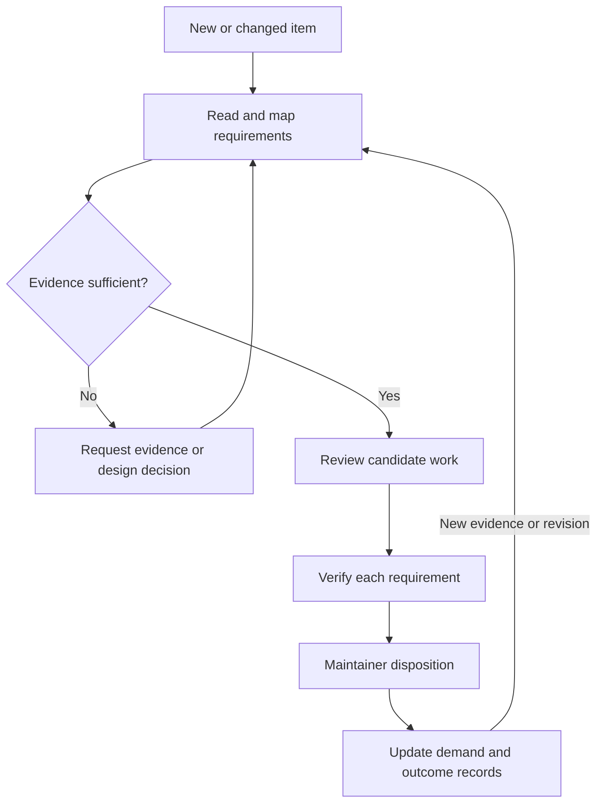

# Continuous Community Triage and Disposition for OpenUSD

**Status:** Working draft for discussion; no adoption or roadmap commitment implied.

## Summary

Establish a repeatable, evidence-based process for connecting community requests
to design decisions, implementation work, verified outcomes, and roadmap input.
The process covers issues and pull requests in OpenUSD and OpenUSD-proposals,
with public AOUSD Build Interest Group initiatives as an initial coordination source.

We propose a six-week pilot, followed by a review of whether and how to continue.
Its primary output is a living disposition register: each reviewed item has a
stated need, evidence, recommended action, accountable next step, and review date.
The pilot examines existing pull requests before proposing new work, and identifies
focused changes that can satisfy multiple independent requirements.

## Problem Statement

Related requests are distributed across issue discussions, proposal reviews,
implementation pull requests, and ecosystem initiatives.
A fix can supersede an old pull request while its original discussion remains open.
A published proposal can leave implementation requirements unresolved.
Similar reports can also describe distinct failures requiring distinct tests.
These relationships are difficult to keep current through individual thread review.

The initial inventory collected October 3–4, 2026 contains 4,391 items across
three repositories, including 1,081 open items.
Within OpenUSD, 587 of 728 open issues had no update for at least one year.
These observations motivate reassessment; they do not establish that old reports
are obsolete or that any item is ready for closure.
Full semantic reading of the corpus remains unfinished.

## Goals

- Give every open item an evidence-backed decision and next step over time.
- Preserve the requested outcome when consolidating duplicates or superseded work.
- Identify existing and potential new PRs with useful coverage of independent needs.
- Separate proposal publication, implementation, verification, and release availability.
- Produce traceable community-demand briefs for OpenUSD and appropriate AOUSD forums.
- Keep the baseline and incoming work current without losing review coverage.

## Scope and Decision Authority

This is a process proposal. It introduces no USD schema, file-format change,
runtime behavior, or new authority over repository decisions.
Maintainers retain control of priorities, labels, closures, and merges.
AOUSD participants determine standards and ecosystem priorities through their
existing processes; the register supplies evidence for those discussions.
Named pilot participants and their capacity need to be agreed before operation.

The baseline includes open and historical issues and PRs in
[OpenUSD](https://github.com/PixarAnimationStudios/OpenUSD) and
[OpenUSD-proposals](https://github.com/PixarAnimationStudios/OpenUSD-proposals).
The initial coordination source is
[AOUSD Build IG initiatives](https://github.com/aousd/build-ig-initiatives).
Additional AOUSD sources can be included after their scope and public availability
are confirmed. GitHub demand is a partial view of the community.

## Definitions

| Term | Meaning |
| --- | --- |
| Disposition | An explicit decision, rationale, and accountable next step; an item can remain open. |
| Independent requirement | A distinct requested outcome with its own acceptance criterion, even if several reports describe it. |
| Coverage | The documented relationship between a requirement and a candidate change: complete, partial, possible, or unrelated. |
| Verified resolution | Evidence that the reported behavior is satisfied on a specified revision and environment. |
| Roadmap signal | A sourced account of unmet needs and dependencies for consideration by a decision forum. |

## Proposed Workflow

### Inventory and Reading Coverage

Enumerate paginated collections and deduplicate by repository, item type, and
number. Record retrieval times and revisions rather than implying an atomic snapshot.
Read each item's body, comments, reviews, relevant changed files, and linked
design or implementation evidence. Record unavailable or truncated content.
Historical reading provides prior decisions, fixes, and rejected approaches.

Keep separate states for inventoried, discussion read, implementation examined,
and behavior verified. A title classification or collected diff does not count as
full semantic review. Publish coverage denominators by repository, type, and state.
Continue baseline reading while servicing incoming changes.

Incremental collection uses an overlap around its last successful watermark.
Advance the watermark only after successful collection, deduplicate repeat events,
and periodically reconcile the full open inventory.
New comments or PR revisions reopen the affected review conclusions.

### Disposition Record

The initial register can be Markdown with a machine-readable export.
Tooling should follow experience from the pilot rather than precede it.

| Field | Required information |
| --- | --- |
| Identity | Canonical URL, repository, issue or PR number, current state, and reviewed revision/time. |
| Requirement | Requested outcome, affected workflow, environment, and acceptance criteria. |
| Evidence | Supporting comments, code, tests, prior decisions, and outstanding reading gaps. |
| Relationships | Duplicate of, supersedes, implements, partially addresses, or blocked by; include evidence for each claim. |
| Recommendation | Proposed disposition, rationale, confidence, and evidence still needed. |
| Next action | Confirmed owner or unassigned responsible role, blocker, and review date. |
| Outcome | Maintainer decision, verification result, implementation revision, and applicable release. |
| Roadmap | Theme, independent demand, decision needed, and proposed forum. |

### Disposition Criteria

| Action | Minimum basis |
| --- | --- |
| Resolve | Match every retained requirement to a verified fix and applicable revision/environment. |
| Consolidate duplicate or superseded work | Identify the canonical record and preserve distinct requirements and evidence. |
| Advance an existing PR | Identify exact coverage, review blockers, missing tests, and integration dependencies. |
| Propose a new PR | Define focused scope, affected requirements, acceptance tests, and dependencies. |
| Request information | Specify the missing reproduction, environment, measurement, or design decision. |
| Defer or decline | Record the authorized rationale, alternative, and revisit trigger. |
| Route elsewhere | Identify an appropriate destination and retain the source until the handoff is acknowledged. |

Age, silence, a closure phrase in a PR, and a merged proposal are individually
insufficient evidence of resolution. A changed PR requires renewed review of
the affected requirements. Sensitive security reports follow the repository's
security reporting process.

### Select Work with Useful Reach

For each candidate, list its affected items and independent requirements separately.
Review existing PRs first. Report complete, partial, and speculative coverage separately.
Deduplicate requirements across the selected portfolio so overlapping candidates
do not inflate the claimed benefit.

Rank candidates by severity, workflow impact, additional verified coverage,
readiness, confidence, effort, compatibility risk, and maintenance cost.
Keep those factors visible rather than hiding uncertainty in a single score.
Urgent correctness and security work can take precedence over broad coverage.
Split unrelated fixes even if combining them would increase an apparent closure count.

### Community Demand and Roadmap Input

Each brief states the use case, linked evidence, independent requirements,
publicly evidenced participants, chronology, unresolved decisions, alternatives,
compatibility implications, dependencies, and suggested next milestone.
Compare historical and recent demand with explicit time windows and denominators.
Do not equate authors, comments, reactions, or duplicate reports with independent demand.

Route implementation questions to OpenUSD maintainers and proposal shepherds.
Route specification or interoperability questions to an appropriate AOUSD forum
after checking its charter. Build and distribution topics should first reconcile
the existing public Build IG initiatives and linked implementation work.
Some topics require coordinated implementation and specification decisions.
A brief records a recommendation, not a commitment by either project.

## Pilot and Acceptance Criteria

The pilot starts when maintainers agree to a steward, component reviewers,
a proposal shepherd, and an AOUSD coordination contact where needed.
One person may fill several roles; unavailable ownership is recorded explicitly.

| Period | Work | Reviewable output |
| --- | --- | --- |
| Weeks 1–2 | Refresh inventory; calibrate reading effort; review a bounded sample across all four portfolios. | Coverage ledger, agreed sample, and source-linked requirement records. |
| Weeks 3–4 | Review existing PRs and historical fixes; validate candidate coverage with component reviewers. | Disposition batch and a ranked opportunity portfolio with per-requirement tests. |
| Weeks 5–6 | Present decisions for maintainers; reconcile outcomes; prepare demand briefs. | Decision log, outcome measures, and a continue/change/stop recommendation. |

At kickoff, select a feasible sample, for example 20–30 open items, based on
available reviewer capacity. This is a pilot target, not a throughput promise.
Acceptance requires every selected item to have a readable evidence record,
an explicit recommendation, a confirmed owner or visible ownership gap, and a next step.
Every claimed resolution must carry verification evidence; unverified candidates
remain labeled as such. At least one portfolio should demonstrate deduplicated
coverage across multiple independent requirements.

Measure reading coverage, evidence gaps, time to first triage, intake versus
dispositions, review blockers, independent needs verified, and reopened decisions.
Report publication, implementation, and release status separately.
Evaluate maintainer effort as well as throughput; closures alone are not success.

If continued, propose daily incremental intake, weekly disposition review,
monthly inventory reconciliation and demand reporting, and quarterly priority review.
The cadence depends on agreed capacity. This document activates no scheduled service.
Complete historical reading remains a long-term baseline goal beyond the pilot.

## Risks and Alternatives

| Risk | Mitigation |
| --- | --- |
| Premature closure from superficial matches | Per-requirement evidence and maintainer review; preserve residual needs. |
| Administrative burden | Small pilot, minimal fields, reuse existing discussions, measure reviewer effort. |
| Coverage incentives favor large PRs | Count marginal independent coverage and retain urgent single-item work. |
| Stale register or automated summaries | Revision tracking, periodic reconciliation, and explicit human review. |
| Community demand overrepresented by vocal participants | Separate duplicates and independent needs; state GitHub participation limits. |
| Process interpreted as roadmap authority | Preserve existing maintainers and AOUSD decision processes. |

Continuing ad hoc triage has low startup cost but leaves cross-repository
relationships hard to audit. Label-only classification aids discovery but cannot
represent partial coverage or verification. Automated stale closure reduces item
counts without establishing outcomes. A dedicated service might eventually help,
but a document-based pilot can first establish useful fields and actual workload.

## Out of Scope

Automatic closures or merges, replacement of repository governance, assigned
roadmap dates, new schemas, and mandates on AOUSD groups are outside this proposal.
Automation may collect or suggest records; maintainers authorize repository actions.
There is no `.usda` example because the proposed change concerns review operations
and makes no change to scene representation.

## Questions for Review

1. Is OpenUSD-proposals an appropriate home for this process proposal and its living register?
2. Which components and reviewers should participate in the first bounded pilot?
3. What evidence and release conditions should maintainers require for resolution?
4. Which public AOUSD coordination sources should follow the Build IG pilot?
5. What cadence can participants sustain, and where should ongoing records live?

## References and Proposal Precedents

The structure follows the repository's
[proposal guidance](https://github.com/PixarAnimationStudios/OpenUSD-proposals/blob/main/README.md)
and [PR template](https://github.com/PixarAnimationStudios/OpenUSD-proposals/blob/main/.github/pull_request_template.md).
Recently accepted examples reviewed for this draft include
[Authorship, PR 106](https://github.com/PixarAnimationStudios/OpenUSD-proposals/pull/106)
(merged September 9, 2026),
[Back Plate, PR 104](https://github.com/PixarAnimationStudios/OpenUSD-proposals/pull/104)
(June 5, 2026), and
[LOD, PR 81](https://github.com/PixarAnimationStudios/OpenUSD-proposals/pull/81)
(June 30, 2026).
[Alternate Libwork implementations, PR 86](https://github.com/PixarAnimationStudios/OpenUSD-proposals/pull/86)
(September 24, 2025) provides a focused technical-action example.
Their useful patterns are clear motivation, explicit boundaries, concrete examples,
implementation considerations, and alternatives; they do not imply acceptance of this proposal.

## Appendix: Initial Evidence and Candidate Portfolios

The following findings are from retained, non-atomic October 3–4, 2026 snapshots.
They are preliminary inputs to the pilot and should be refreshed before action.
Inventory is complete for those retained snapshots; full semantic reading is unfinished.
No independent OpenUSD builds or behavioral closure verification were performed.
No confirmed closure count is claimed.

| Repository | Inventoried items | Open issues | Open PRs |
| --- | ---: | ---: | ---: |
| OpenUSD | 4,224 | 728 | 283 |
| OpenUSD-proposals | 116 | 12 | 25 |
| AOUSD Build IG initiatives | 51 | 32 | 1 |
| Total | 4,391 | 772 | 309 |

Four candidate portfolios organize the reviewed evidence:

| Portfolio | Recurring needs | Pilot focus |
| --- | --- | --- |
| Build and distribution | Portable CMake, runnable development trees, useful Python packages. | Reconcile existing Build IG initiatives and implementation PRs. |
| Hydra reliability | Material binding, nested instances, consistent live edits. | Shared regression fixtures with distinct fixes and acceptance criteria. |
| Composition and scale | Variant performance, deterministic instancing, animation timing. | Remeasure older reports and review matching PRs. |
| Metadata and presentation | Portable shader UI, text, LineStyle, localization. | Separate representation needs from rendering and interoperability decisions. |

These are evidence-backed work groupings, not measured community-wide rankings.
Title screening was used for discovery and is not a validated demand classification.
Start with superseded-work reconciliation, revalidation of older behavior, and
existing evidence-ready PRs; urgent correctness or security reports take precedence.

### Candidate Register

Each row records a proposed next action and its acceptance criteria.
Owners are unassigned; each responsible role below is a suggestion for pilot review.

| ID and candidate | Source items | Proposed next action | Acceptance criteria and proposed role |
| --- | --- | --- | --- |
| R01: Parser robustness | [4215](https://github.com/PixarAnimationStudios/OpenUSD/issues/4215); [4217](https://github.com/PixarAnimationStudios/OpenUSD/issues/4217); [4218](https://github.com/PixarAnimationStudios/OpenUSD/issues/4218) | Confirm stock-input reproduction and owner; use the repository security-advisory route for sensitive follow-up. Do not conflate harness-only and stock-input failures. | Separate minimal stock-file reproduction, sanitizer evidence and affected revisions; regression per failure. **Suggested role:** Sdf parser maintainer |
| R02: Superseded retyping PR | [4042](https://github.com/PixarAnimationStudios/OpenUSD/pull/4042); [4040](https://github.com/PixarAnimationStudios/OpenUSD/issues/4040); [7385066a5847530903a1711375462c2a4f341478](https://github.com/PixarAnimationStudios/OpenUSD/commit/7385066a5847530903a1711375462c2a4f341478) | Recommend closing or retargeting the PR after comparing residual scope with incorporated retyping logic. | Confirm current behavior on the original TransferContent case; compare commit 7385066a and retained test coverage. **Suggested role:** UsdImaging maintainer / PR author |
| R03: Superseded notice workaround | [3566](https://github.com/PixarAnimationStudios/OpenUSD/pull/3566); [3563](https://github.com/PixarAnimationStudios/OpenUSD/issues/3563); [c7e64d1197ccfe8ae85b0b1da712fe575b51ad22](https://github.com/PixarAnimationStudios/OpenUSD/commit/c7e64d1197ccfe8ae85b0b1da712fe575b51ad22) | Recommend closing the old workaround if no residual requirement remains; retain atomic notification questions as a separate design topic. | Replay the duplicate-instance case against batched-notice code and recorded regression; do not equate issue closure with a new notification API. **Suggested role:** UsdImaging maintainer / PR author |
| R04: Build policy tracker | [38](https://github.com/aousd/build-ig-initiatives/issues/38); [46](https://github.com/aousd/build-ig-initiatives/pull/46); [deprecation_strategy.md](https://github.com/aousd/build-ig-initiatives/blob/main/deprecation_strategy.md) | Confirm that the published deprecation document satisfies the tracker; record the decision and close if complete. | Published document and adopted scope match the initiative; preserve build-only applicability. **Suggested role:** Build IG initiative shepherd |
| R05: Build branch tracker | [44](https://github.com/aousd/build-ig-initiatives/issues/44); [build-ig](https://github.com/PixarAnimationStudios/OpenUSD/tree/build-ig); [4079](https://github.com/PixarAnimationStudios/OpenUSD/pull/4079) | Update status to distinguish existing branch from remaining approval and workflow requirements. | Branch ownership, contribution route and synchronization procedure recorded. **Suggested role:** Build IG shepherd / Pixar build maintainer |
| R06: Variant performance | [1957](https://github.com/PixarAnimationStudios/OpenUSD/issues/1957); [2010](https://github.com/PixarAnimationStudios/OpenUSD/issues/2010) | Measure current performance before commissioning new work; retain residual selection and authoring costs separately. | Replay both scaling cases on old and current revisions; record data and target interactive envelope. **Suggested role:** Composition performance maintainer |
| R07: Mixed-rate flattening | [4258](https://github.com/PixarAnimationStudios/OpenUSD/pull/4258); [3072](https://github.com/PixarAnimationStudios/OpenUSD/issues/3072) | Review the focused production change and regression matrix; reconcile inherited fork-handoff wording with its current upstream location. | References and payloads preserve times and values for basic, nested-offset and cancellation cases; independently verify CI. **Suggested role:** Composition / UsdUtils maintainer |
| R08: Shader diagnostics | [4049](https://github.com/PixarAnimationStudios/OpenUSD/pull/4049); [4048](https://github.com/PixarAnimationStudios/OpenUSD/issues/4048) | Implement the requested debug control or separate failing-source accessor; preserve the normal compile-error channel. | Exercise GL, Vulkan and Metal failures; generated-source line numbers match driver diagnostics; normal errors remain concise. **Suggested role:** Hgi maintainer / PR author |
| R09: Point-instancer bounds | [3396](https://github.com/PixarAnimationStudios/OpenUSD/pull/3396); [3395](https://github.com/PixarAnimationStudios/OpenUSD/issues/3395) | Review traversal-predicate API and test coverage rather than write a competing bounds fix. | Bounds work for prototypes under overs while default traversal, purpose, visibility and unloaded extents-hint behavior stay correct. **Suggested role:** UsdGeom maintainer |
| R10: Point-instancer IDs | [3977](https://github.com/PixarAnimationStudios/OpenUSD/pull/3977); [3976](https://github.com/PixarAnimationStudios/OpenUSD/issues/3976) | Separate data-source exposure from renderer support; decide portable 64-bit representation. | Authored primvars override automatic IDs; large and negative IDs work across supported delegates/backends. **Suggested role:** UsdImaging / Hgi / renderer maintainers |
| R11: Implicit sidedness | [3689](https://github.com/PixarAnimationStudios/OpenUSD/pull/3689); [3686](https://github.com/PixarAnimationStudios/OpenUSD/issues/3686) | Add focused parity tests for implicit geometry and assess schema migration. | doubleSided reaches render delegates; include cameras inside shapes and relevant transparent/CSG cases. **Suggested role:** Hydra schema maintainer |
| R12: Shader validation | [4086](https://github.com/PixarAnimationStudios/OpenUSD/pull/4086); [3957](https://github.com/PixarAnimationStudios/OpenUSD/issues/3957) | Retain validator as partial implementation; separately cover documentation, CanConnect behavior and tests. | Reject invalid sibling input wiring in validation and agreed query behavior; preserve valid container and sibling-output connections. **Suggested role:** UsdShade / validation maintainers |
| R13: Hydra material parity | [3320](https://github.com/PixarAnimationStudios/OpenUSD/issues/3320); [3484](https://github.com/PixarAnimationStudios/OpenUSD/issues/3484); [3690](https://github.com/PixarAnimationStudios/OpenUSD/issues/3690); [4113](https://github.com/PixarAnimationStudios/OpenUSD/issues/4113); [4122](https://github.com/PixarAnimationStudios/OpenUSD/issues/4122); [4121](https://github.com/PixarAnimationStudios/OpenUSD/issues/4121) | Build one acceptance matrix, then propose small fixes per failure boundary. | Compare core binding resolution with scene-index outputs across purpose, collection, nested instances, visibility and physical subsets. **Suggested role:** UsdImaging maintainer / requesting delegate authors |
| R14: Coordinate systems | [4263](https://github.com/PixarAnimationStudios/OpenUSD/issues/4263); [4264](https://github.com/PixarAnimationStudios/OpenUSD/issues/4264) | Investigate propagation and notice consistency as separate fixes with a shared regression fixture. | Instance prototypes retain binding; observer state agrees with GetPrim after adding binding, resync, removal and shared-target edits. **Suggested role:** UsdImaging / Hdsi maintainers |
| R15: Class encapsulation | [94](https://github.com/PixarAnimationStudios/OpenUSD-proposals/pull/94); [3201](https://github.com/PixarAnimationStudios/OpenUSD/issues/3201); [3869](https://github.com/PixarAnimationStudios/OpenUSD/issues/3869); [3751](https://github.com/PixarAnimationStudios/OpenUSD/issues/3751) | Review composition design and legacy imaging symptoms separately; document migration compatibility. | Repeated composition deterministic; internal/file references and session edits covered; no unsupported attribution of legacy imaging bugs to core. **Suggested role:** Composition maintainer / proposal shepherd |
| R16: Variant serialization | [3822](https://github.com/PixarAnimationStudios/OpenUSD/issues/3822); [3954](https://github.com/PixarAnimationStudios/OpenUSD/issues/3954) | Create behavioral conformance examples and confirm specification interpretation before changing formats or validity rules. | USDA/USDC/API round trips, grammar, conditional format bump and legacy behavior documented; resolve empty reference ambiguity. **Suggested role:** Core specification liaison / Sdf maintainer |
| R17: Portable shader UI | [3575](https://github.com/PixarAnimationStudios/OpenUSD/issues/3575); [4099](https://github.com/PixarAnimationStudios/OpenUSD/issues/4099); [100](https://github.com/PixarAnimationStudios/OpenUSD-proposals/pull/100); [118](https://github.com/PixarAnimationStudios/OpenUSD-proposals/pull/118) | Define canonical metadata and a shader-to-schema round-trip example; categorization and ramps cover only portions of demand. | Nested metadata survives; naming aliases are compatible; ordering, hints, categories and conditional visibility retained. **Suggested role:** Sdr maintainer / DCC and renderer authors |
| R18: Portable CMake | [3918](https://github.com/PixarAnimationStudios/OpenUSD/pull/3918); [3919](https://github.com/PixarAnimationStudios/OpenUSD/pull/3919); [3920](https://github.com/PixarAnimationStudios/OpenUSD/pull/3920); [15](https://github.com/aousd/build-ig-initiatives/issues/15); [24](https://github.com/aousd/build-ig-initiatives/issues/24); [50](https://github.com/aousd/build-ig-initiatives/pull/50) | Review coordinated consumer tests and the open package migration plan; preserve unresolved compatibility scope. | Minimal C++ consumer survives relocation and supported dependency variants; old and new package paths tested during transition. **Suggested role:** Build maintainer / Build IG champion |
| R19: Development workflow | [4079](https://github.com/PixarAnimationStudios/OpenUSD/pull/4079); [1984](https://github.com/PixarAnimationStudios/OpenUSD/pull/1984); [4138](https://github.com/PixarAnimationStudios/OpenUSD/pull/4138); [37](https://github.com/aousd/build-ig-initiatives/issues/37) | Coordinate source headers, runnable build tree and tests, with separate installation/runtime contracts. | Clean Windows/Linux/macOS build-tree tools and representative tests run without install; plugin/resources and DLL paths verified. **Suggested role:** Build / test maintainers |
| R20: Binary package contents | [28](https://github.com/aousd/build-ig-initiatives/issues/28); [30](https://github.com/aousd/build-ig-initiatives/issues/30); [47](https://github.com/aousd/build-ig-initiatives/issues/47); [4230](https://github.com/PixarAnimationStudios/OpenUSD/pull/4230); [3114](https://github.com/PixarAnimationStudios/OpenUSD/issues/3114) | Publish package/platform/content matrix; treat imports, subprocess tools, imaging and optional formats separately. | Clean install, import and subprocess execution; declared CLI/imaging/format/platform support and ownership. **Suggested role:** Release / Python packaging maintainer |
| R21: LineStyle | [3844](https://github.com/PixarAnimationStudios/OpenUSD/pull/3844); [3857](https://github.com/PixarAnimationStudios/OpenUSD/pull/3857); [60](https://github.com/PixarAnimationStudios/OpenUSD-proposals/pull/60); [56](https://github.com/PixarAnimationStudios/OpenUSD-proposals/issues/56) | Review shader dependency and feature requirement matrix together; preserve view-dependent architecture decisions. | Caps, joins, patterns, width and multi-view expectations tested per requirement. **Suggested role:** Storm / schema maintainer / proposal shepherd |
| R22: Text schemas | [3258](https://github.com/PixarAnimationStudios/OpenUSD/pull/3258); [3259](https://github.com/PixarAnimationStudios/OpenUSD/pull/3259); [40](https://github.com/PixarAnimationStudios/OpenUSD-proposals/issues/40); [50](https://github.com/PixarAnimationStudios/OpenUSD-proposals/issues/50); [57](https://github.com/PixarAnimationStudios/OpenUSD-proposals/issues/57) | Stage SimpleText before MarkupText and make the addressed/residual matrix explicit. | Schema generation, style binding, layout and text regression coverage; separate rendering and typography fidelity. **Suggested role:** Schema maintainer / text contributor |
| R23: Localization | [78](https://github.com/PixarAnimationStudios/OpenUSD-proposals/pull/78) | Align normative text and examples with accepted discussion direction. | Dictionary catalogs, ancestor lookup, variant display names and layer composition semantics form one coherent draft. **Suggested role:** Proposal author / localization shepherd |
| R24: Spline archival behavior | [115](https://github.com/PixarAnimationStudios/OpenUSD-proposals/pull/115) | Resolve bake-on-read versus parse-and-ignore contradiction before implementation or removal planning. | Old scene read, evaluation, resave and migration behavior defined across releases. **Suggested role:** Ts maintainer / proposal author |
| R25: Release/version API | [113](https://github.com/PixarAnimationStudios/OpenUSD-proposals/pull/113); [117](https://github.com/PixarAnimationStudios/OpenUSD-proposals/pull/117); [3821](https://github.com/PixarAnimationStudios/OpenUSD/issues/3821) | Define metadata accessible before Usd import and plugin registration, alongside release naming and ABI policy. | Patch version available before plugin loading; existing version APIs retained; compatibility examples provided. **Suggested role:** Release / Python bindings maintainers |
| R26: Payload recomposition | [2866](https://github.com/PixarAnimationStudios/OpenUSD/issues/2866) | Check whether the offered patch exists elsewhere before requesting or drafting a competing change. | Load rules and load set agree after downstream unload and forced recomposition. **Suggested role:** Composition maintainer / original contributor |

These 26 recommendations are a starting queue, not 26 approved actions or verified resolutions.
Fresh revisions, reproductions, and maintainer decisions may change their scope and priority.
