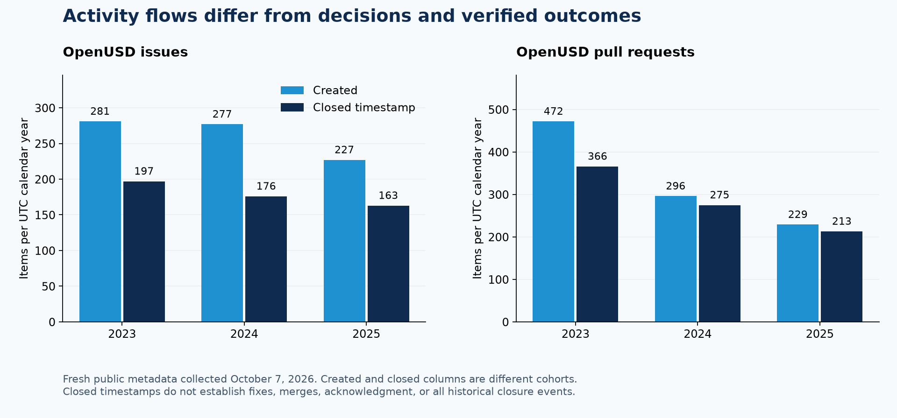

# Triage, disposition, and follow-through: comparative research

Research date: October 7, 2026. Public primary sources only. This is supporting
research for the OpenUSD proposal, not a ranking of projects. Practices, published
observations, and this proposal's inferences are distinguished below.

## What established processes make visible

| Project or standards process | Documented practice | Proposed application to OpenUSD |
| --- | --- | --- |
| [Kubernetes issue triage](https://www.kubernetes.dev/docs/guide/issue-triage/) | SIGs classify incoming work, establish ownership and priority, and follow up. Triage can be continuous or scheduled. Labels, bot commands, Triage Party, project boards, and DevStats support the work. | Distribute preparation by expertise; use a shared vocabulary and focused decision queues. A triaged backlog item can remain unimplemented. |
| [Rust RFCs](https://github.com/rust-lang/rfcs) | Relevant teams review proposals, summarize tradeoffs, and enter a final comment period with a proposed merge, close, or postpone disposition. The period normally lasts ten calendar days. An active RFC does not guarantee implementation. | Prepare an explicit question, alternatives, rationale, and objection record. Keep a proposal decision distinct from implementation and adoption. |
| [Rust compiler prioritization](https://forge.rust-lang.org/compiler/prioritization.html) and [Rustbot](https://forge.rust-lang.org/triagebot/index.html) | Prioritization records reasoning and supports a triage agenda. Repository-configured automation handles labels, assignment, and workflow states such as waiting on an author or being blocked. | Automation should maintain state and prepare agendas around accountable human decisions. A label describes a stage; it does not prove an outcome. |
| [Python PEP 1](https://peps.python.org/pep-0001/) | Draft, accepted, provisional, final, deferred, rejected, and withdrawn states represent different outcomes. Acceptance precedes final implementation. Decision authority and editorial work have different roles. | Track agreement, implementation, verification, and release separately. Preserve why a domain proposal was deferred or rejected and what evidence could reopen it. |
| [W3C document review](https://www.w3.org/guide/documentreview/) | Wide review includes cross-cutting concerns. A disposition of comments summarizes resolutions. Dated drafts and identification of substantive changes support review. | Make cross-domain interoperability questions and their treatment inspectable; re-review changed evidence rather than repeating all earlier investigation. |
| [IETF RFC process](https://www.ietf.org/process/rfcs/) and [RPC community minutes](https://datatracker.ietf.org/doc/minutes-interim-2025-rpc-04-202506251900/) | Public records track documents through distinct stages. The RPC reported work on clearer queue state, intake, author support, and qualitative as well as quantitative service measures. | Expose where a case is waiting and why. Measure preparation, authoritative decisions, implementation, and publication as separate stages. |

These applications are proposals inferred from the documented practices; the
sources do not establish that any one practice will deliver the same benefit in
OpenUSD. Kubernetes also documents age-based stale handling. That policy makes its
closure statistics particularly unsuitable as a proxy for verified resolution.
This proposal would use age to select reassessment work.

## Quantitative observations and their limits

### Public repository activity in 2025

GitHub Search API queries were run on October 7, 2026, using `is:issue` and UTC
calendar-year `created:` or `closed:` filters. Each response reported
`incomplete_results=false`. PRs were excluded. Exact queries and retrieval times
are retained in [project-flow-counts.json](project-flow-counts.json).

| Repository | Issues created in 2025 | Issues with a closed timestamp in 2025 | Closed timestamps per calendar month, annual total / 12 |
| --- | ---: | ---: | ---: |
| [CPython](https://github.com/python/cpython/issues?q=is%3Aissue+created%3A2025-01-01..2025-12-31) | 4,318 | 4,393 | 366.1 |
| [Kubernetes](https://github.com/kubernetes/kubernetes/issues?q=is%3Aissue+created%3A2025-01-01..2025-12-31) | 1,859 | 1,928 | 160.7 |
| [Rust](https://github.com/rust-lang/rust/issues?q=is%3Aissue+created%3A2025-01-01..2025-12-31) | 4,868 | 3,824 | 318.7 |

The created and closed columns describe different cohorts. Closures can concern
older items, and current timestamps can change after reopening and reclosing.
These are observed activity flows, not acceptance percentages, first-triage rates,
unique requirements satisfied, or a comparison of maintainer efficiency. Repository
scope, intake practices, imported history, complexity, staffing, and closure
policies differ. The monthly values are arithmetic annual averages, not a measured
monthly time series or an operating commitment.

### Standards processes

The [W3C Process 2023 disposition report](https://www.w3.org/policies/process/drafts/issues-20211102),
dated April 6, 2023, records **66 issues deferred to a later revision**, including
issues from earlier cycles. It groups **125 issue/PR closures** as accepted,
retracted, or question answered, **20** as invalid, duplicate, or out of scope, and
**15** as rejected across three response-status groups. Two rejected issues
recorded unsatisfied commenters. These are a particular process-revision cycle's
documented categories, not an annual rate or evidence that every concern was
accepted. Their useful precedent is an explicit outcome and objection record,
including work left open after an authorized deferral.

The [IETF 2025 snapshot](https://www.ietf.org/media/documents/IETF-Snapshot-2025.pdf)
reports **3,274 uniquely named Internet-Drafts submitted** and **208 RFCs
published** in 2025. Those populations belong to different stages and cohorts;
208 / 3,274 would not be an acceptance or disposition rate. The
[June 25, 2025 RPC minutes](https://datatracker.ietf.org/doc/minutes-interim-2025-rpc-04-202506251900/)
report an average of approximately **13 weeks from EDIT through AUTH48**. That is
a publication-stage measure, not time from initial idea to consensus or a promise
for current queue conditions.

No comparable, independently verified rate of semantic triage or requirements
resolution across these projects was established by the sources reviewed. The
proposal therefore uses these figures to illustrate scale and stage-specific
measurement, while proposing its own explicit coverage and decision measures.

## Independent OpenUSD trend analysis

A fresh enumeration used all pages of the public GitHub REST issues API for
OpenUSD, OpenUSD-proposals, and Build IG initiatives. It separated issues and PRs,
deduplicated repository/number pairs, and retained collection checkpoints.
[openusd-trends.json](openusd-trends.json) contains the derived counts and method.
The metadata collection did not read all comments, review code, establish causes,
or verify reported behavior. It is a non-atomic snapshot, not a replacement for
semantic assessment.

| OpenUSD item type | 2023 created / closed timestamp | 2024 created / closed timestamp | 2025 created / closed timestamp |
| --- | ---: | ---: | ---: |
| Issues | 281 / 197 | 277 / 176 | 227 / 163 |
| PRs | 472 / 366 | 296 / 275 | 229 / 213 |

**Observation:** annual issue creation declined about 19% between 2023 and 2025,
and PR creation declined about 51%. Created items exceeded items with closure
timestamps in each displayed year. These timestamp balances are not complete
historical backlog changes: reopened events and unavailable items are not captured.
Nothing here establishes the reason for the trend or a decline in ecosystem need.
In particular, the proposal should not claim accelerating GitHub intake as the
basis for its strategic problem statement.

The fresh enumeration found 4,399 items: 4,231 in OpenUSD, 117 in proposals, and 51
in Build IG initiatives. Of 727 currently open OpenUSD issues, 581 (79.9%) had an
`updated_at` timestamp older than 365 days at collection. Of 286 open OpenUSD PRs,
160 (55.9%) met that condition. Age identifies a reassessment population; it does
not establish abandonment, unresolved behavior, absence of work elsewhere, or
readiness for closure. Historical snapshot figures in the candidate register are
retained with their original dates rather than silently replaced.

**Implications proposed here:** measure current assessment coverage alongside
fresh intake; maintain links to earlier decisions and work; and examine whether
focused changes satisfy independent requirements. GitHub activity is one evidence
channel. Domain experimentation, standards review, interoperability testing, and
adoption require additional public or publication-authorized evidence. The four
earlier candidate portfolios remain hypotheses, not validated community demand
rankings. Title and label counts would not establish those rankings.

## Technologies and an agentic operating model

Established technology already supports parts of the workflow: Kubernetes names
multi-repository Triage Party views and DevStats; Rustbot manages workflow state;
Python exposes [PEP metadata through an API](https://peps.python.org/api/).
[GitHub's community issue-metrics project](https://github.com/github-community-projects/issue-metrics)
produces response, review, and closure measures and machine-readable reports.
[CHAOSS issue resolution duration](https://www.chaoss.community/kb/metric-issue-resolution-duration/)
defines closure timing and distinguishes creation and closure observation windows.
Those measures need outcome interpretation and open-case coverage alongside them.

The proposed agent layer would add connected research, requirement extraction,
relationship hypotheses, reproduction preparation, and change-driven refresh.
Persistent revision-aware records, exact evidence references, resumable tasks, and
separate observed/inferred/validated/authorized states would make that work
inspectable. Conventional automation can collect events and publish reports;
agents would handle bounded semantic preparation, with contributors validating
the findings used for decisions. No particular product is required.

The [Python 2026 developer-in-residence update](https://blog.python.org/2026/09/language-summit-2026-developer-in-residence-update-and-future/)
reports that a large volume of likely LLM-generated PR submissions disrupted earlier backlog
progress. That supports a concrete evaluation principle: count useful checked
evidence and outcomes relative to total human effort, rather than generated PRs
or agent activity. These sources do not demonstrate that agentic assistance has
already solved full-corpus disposition. That remains the proposal's measurable
scaling hypothesis.
