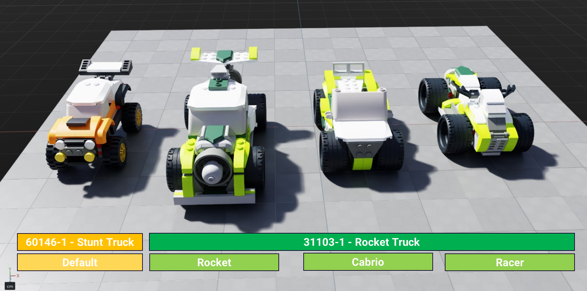
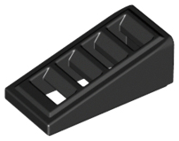
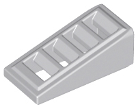

# LEGO as a PLM Case Study for Source Identifiers in USD

michael.wagner@synctwin.ai

## Contents

- [Overview](#overview)
- [The LEGO parts library and LDraw](#the-lego-parts-library-and-ldraw)
- [The two sets](#the-two-sets)
- [The example part](#the-example-part)
  - [Cross-system part identifiers](#cross-system-part-identifiers)
  - [Appearance in 60146-1 — Stunt Truck](#appearance-in-60146-1--stunt-truck)
  - [Appearance in 31103-1 — Rocket Truck](#appearance-in-31103-1--rocket-truck)
  - [Color identifier divergence](#color-identifier-divergence)
- [Mapping to proposal use cases](#mapping-to-proposal-use-cases)
  - [Instance identity vs. source identity](#instance-identity-vs-source-identity)
  - [BOM generation requires discoverable source identifiers](#bom-generation-requires-discoverable-source-identifiers)
  - [Data loss on ingest: leading-digit identifiers](#data-loss-on-ingest-leading-digit-identifiers)
  - [Round-trip fidelity: LDraw part suffixes](#round-trip-fidelity-ldraw-part-suffixes)
  - [Cross-system identifiers as a metadata package](#cross-system-identifiers-as-a-metadata-package)
  - [Supplier catalog numbers](#supplier-catalog-numbers)
  - [Multi-configuration set: variants and composition](#multi-configuration-set-variants-and-composition)
- [USD scene sketch](#usd-scene-sketch)
- [Approach A: `assetInfo` sub-dictionaries](#approach-a-assetinfo-sub-dictionaries)
- [Approach B: applied schema with typed properties](#approach-b-applied-schema-with-typed-properties)
- [Comparison in the LEGO context](#comparison-in-the-lego-context)

---

## Overview

LEGO is an unexpectedly rich case study for the identifier problems described in this proposal. The LEGO brick ecosystem spans a large, publicly documented part library with independently maintained databases across multiple community and commercial systems — each assigning their own identifiers to the same physical objects. The community has produced CAD authoring tools, 3D asset libraries, and part databases (see [LDraw File Format Specification](https://www.ldraw.org/article/218.html), [LDraw Colour Comparison Chart](https://wiki.ldraw.org/wiki/User:Owen_Burgoyne/LDraw_Colour_Comparison_Chart)) that together constitute a de facto PLM ecosystem for plastic bricks.



Two LEGO sets illustrate the full range of identifier concerns raised in this proposal:

- **Set 60146-1 — Stunt Truck** (City theme, 2017): a single-build vehicle model.
- **Set 31103-1 — Rocket Truck** (Creator 3-in-1, 2020): a multi-configuration set whose single inventory of parts assembles into three distinct models — *Rocket Truck*, *Cabrio*, and *Racer*.

A single part — the **Slope 18° 2×1×2/3 with Grille** (LEGO Design ID `61409`, informally the "cheese grater slope") — appears in both sets, in different colors, in multiple instances per set. This one part carries identifiers from at least six distinct systems, illustrating in miniature the cross-system identifier problem that industrial PLM integrations face at scale.

| Set 60146-1 — Stunt Truck | Set 31103-1 — Rocket Truck |
|:---:|:---:|
| Part `61409` in **Black** (Element ID `4541191`, qty 4) | Part `61409` in **Medium Stone Grey** (Element ID `6092111`, qty 2) |
|  |  |

---

## The LEGO parts library and LDraw

LEGO's parts library is documented in two complementary forms.

**LEGO's own catalog.** Each part shape is assigned a **Design ID** — the color-independent identifier for the geometry, assigned by The LEGO Group. Each specific combination of shape and color is assigned an **Element ID** — the identifier used in pick-and-pack operations, packaging, and spare-part ordering. Design ID and Element ID are distinct: multiple Element IDs (one per color) map to a single Design ID.

The LEGO set numbering follows the same logic one level up: a **set number** (e.g., `60146`) identifies the design, and a **market variant suffix** (`-1`, `-2`, ...) distinguishes re-releases in different packaging or regional editions. The full set identifier `60146-1` is analogous to a PLM part number with a revision code.

**LDraw.** An open community standard for representing LEGO parts and assemblies as CAD geometry ([LDraw File Format Specification](https://www.ldraw.org/article/218.html)). LDraw assigns its own part numbers, stored as filenames (e.g., `61409b.dat`). These often correspond to LEGO Design IDs but may carry letter suffixes to distinguish geometry variants — `61409b` differs from `61409` in the LDraw library. In an LDraw assembly file (`.ldr`), each part placement is a Line Type 1 record specifying a part filename, a color code, and a 3×3 transformation matrix — analogous to a USD sub-file reference with a transformation applied.

The LDraw ecosystem has spawned additional community databases, each with its own identifier space:

| System | Part identifier | Color identifier | Notes |
|--------|----------------|-----------------|-------|
| LEGO official | Design ID (integer) | Element ID (design + color); LDD color code (integer) | Color names defined by LEGO |
| LDraw | Part filename without extension (may have letter suffix) | Numeric color code (integer, from `ldconfig.ldr`) | Separate numbering from LEGO LDD |
| BrickLink | Part number (often equals Design ID) | BrickLink color ID (integer) | Commercial marketplace |
| BrickOwl | Base BOID (integer, all colors) | Color variant BOID (base + dash + suffix) | Commercial marketplace |
| Rebrickable | Part number (often equals Design ID) | Own integer color ID | Community aggregator |
| Peeron | Part number | Color name + RGB | Historical; largely superseded |

---

## The two sets

**Set 60146-1 — Stunt Truck** is a City-theme vehicle set from 2017, a straightforward single-build model. Its part inventory is fixed: one configuration, one BOM.

**Set 31103-1 — Rocket Truck** is a Creator 3-in-1 set from 2020. One box of parts, three instruction booklets, three buildable models:

| Build variant | Model type |
|--------------|-----------|
| Rocket Truck | Main build — truck with rocket payload |
| Cabrio | Convertible roadster |
| Racer | Racing car |

The physical parts are shared across all three builds. The BOM for the set (the parts in the box) is the same regardless of which model is assembled. But the *allocation* of parts to a specific build — which parts are used, where — varies per variant. This is a configuration management problem: the same set asset (31103-1) supports three distinct configurations, each with its own structure and logical BOM.

---

## The example part

### Cross-system part identifiers

The **Slope 18° 2×1×2/3 with Grille** is a common decorative and structural element found across hundreds of LEGO sets. Its cross-system identifiers:

| System | Identifier | Value |
|--------|-----------|-------|
| LEGO Design ID | Shape, color-independent | `61409` |
| LDraw | Part filename (geometry variant) | `61409b` |
| BrickLink | Part number | `61409` |
| Rebrickable | Part number | `61409` |
| BrickOwl | Base BOID (all color variants) | `912280` |

Four of the five systems converge on `61409`. The LDraw part number is `61409b` — the `b` suffix indicates a specific geometry variant in the LDraw parts library, distinct from any `61409a` variant. A naive deduplication that equates `61409` and `61409b` would either lose the distinction or incorrectly merge two different data records.

### Appearance in 60146-1 — Stunt Truck

The slope appears **4 times** in the Stunt Truck, in **Black**:

| Attribute | Value |
|-----------|-------|
| LEGO Element ID | `4541191` |
| LDraw color code | `0` (Black) |
| LEGO LDD color code | `26` (Black) |
| BrickLink color ID | `11` (Black) |
| BrickOwl color variant BOID | `912280-38` |
| Quantity in set | 4 |

### Appearance in 31103-1 — Rocket Truck

The slope appears **2 times** in the Rocket Truck build, in **Medium Stone Grey** (called *Light Bluish Gray* in BrickLink and LDraw):

| Attribute | Value |
|-----------|-------|
| LEGO Element ID | `6092111` |
| LDraw color code | `71` (Light Bluish Gray) |
| LEGO LDD color code | `194` (Medium Stone Grey) |
| BrickLink color ID | `86` (Light Bluish Gray) |
| BrickOwl color variant BOID | `912280-64` |
| Quantity in set | 2 |

### Color identifier divergence

LEGO's "Medium Stone Grey" is identified differently in every system:

| System | Color name used | Color ID | RGB |
|--------|----------------|---------|-----|
| LEGO official (LDD) | Medium Stone Grey | `194` | `969696` |
| LDraw | Light Bluish Gray | `71` | `A0A5A9` |
| BrickLink | Light Bluish Gray | `86` | — |
| Rebrickable | Light Bluish Gray | own integer | — |
| Peeron | Light Bluish Gray | — | `A3A2A4` |

Five systems, five representations — different names, different numeric IDs, different RGB values for the same color. A pipeline exchanging data between an LDraw-based tool (color `71`) and a BrickLink-based inventory system (color `86`) needs both identifiers present to avoid a lookup table dependency. Storing only one color ID locks the data to one system.

This situation is not unique to LEGO. The same divergence occurs in any domain where multiple standards bodies and tool vendors independently codify the same real-world attributes: the identifiers are parallel, not hierarchical, and no single one is "canonical" across all consuming systems.

---

## Mapping to proposal use cases

### Instance identity vs. source identity

Each of the 4 black slope placements in the Stunt Truck occupies a distinct location in the model. In a USD scene each is a distinct prim with a unique namespace path — `/StuntTruck/Body/FrontSlope_1`, `/StuntTruck/Body/FrontSlope_2`, etc. But all four share the same **source identity**: LEGO Design ID `61409`, Element ID `4541191`.

This is precisely the scenario used to motivate the separation of concerns in the proposal: "Consider a building where the same door type is placed in 30 locations. Each placement has a unique namespace path, but they all share a source identity." The 4 slopes are the LEGO analogue of those 30 doors.

The Design ID captures *type-level* identity (what kind of part is this?), while the Element ID adds color and captures *catalog-level* identity (which specific part, ready to order?). Both are distinct from the USD namespace path, which captures *instance-level* identity (which specific placement in this scene?). All three coexist on the same prim without conflict.

### BOM generation requires discoverable source identifiers

A Bill of Materials for the Stunt Truck is generated by traversing the USD stage and aggregating source identifiers. The expected result is a single BOM line: **qty 4, Element ID `4541191`** (Black Slope 18° 2×1×2/3 with Grille).

This aggregation is only possible if:

1. All four slope prims carry the same source identifier (`elementId = "4541191"`), and
2. That identifier is stored in a **discoverable, standardized location** — not buried in ad-hoc `customData` with a key known only to the authoring tool.

Without a standardized source identifier mechanism, a BOM tool must either parse prim names (where the Element ID may have been altered to satisfy USD grammar rules, or may not appear at all) or have prior knowledge of the pipeline-specific `customData` key used upstream. Neither approach is interoperable.

### Data loss on ingest: leading-digit identifiers

LEGO Element ID `4541191` begins with a digit. Under USD's XID-based prim name grammar (introduced in v24.03), leading digits remain invalid. When ingesting a LEGO parts inventory into USD, each slope instance must be assigned a synthetic prim name (`Slope_1`, `Slope_2`, ...) — and the Element ID, the identifier that makes BOM generation possible, must be stored separately.

Without a standardized field, it is stored in `customData` with a tool-specific key, or silently dropped. This is the "Data loss on ingest" case from the proposal applied to a common real-world identifier type: purely numeric identifiers (LEGO Element IDs, room numbers in AECO, IFC GlobalIds with leading-digit prefixes) are among the most common sources of grammar-driven data loss.

### Round-trip fidelity: LDraw part suffixes

The LDraw part number `61409b` contains a letter suffix distinguishing this geometry variant. While the character `b` is valid in a USD prim name, the identifier must survive a round-trip without the suffix being treated as part of a naming convention, stripped, or concatenated with surrounding context. A string-typed source identifier field preserves it exactly. Encoding it into a prim name introduces ambiguity: is `FrontSlope_61409b_1` a prim named according to a `<name>_<partNumber>_<index>` convention, or does the trailing `_1` belong to the part number?

### Cross-system identifiers as a metadata package

No single integer uniquely identifies the color "Medium Stone Grey" across all LEGO-related tools. A pipeline that exchanges data between an LDraw renderer, a BrickLink inventory system, and a BrickOwl procurement tool needs the LDraw color code (`71`), the BrickLink color ID (`86`), and the BrickOwl color variant BOID (`912280-64`) to be present simultaneously on each colored part prim.

This is the "metadata package" case from the proposal — a single prim needs multiple identifiers from multiple systems at once. The LEGO color example is notable because all of these identifiers live within a single domain (LEGO parts), demonstrating that even within one ecosystem, parallel identifier systems can be substantial enough to require the full metadata-package treatment.

The structural column example from the proposal (IFC GlobalId + Revit ElementId + Uniclass classification) is cross-domain. The LEGO color example is intra-domain. Both require the same mechanism.

### Supplier catalog numbers

BrickLink, BrickOwl, and Rebrickable are third-party marketplaces that each assign their own catalog numbers to LEGO parts. From a supply chain perspective they are effectively "suppliers" with distinct catalog systems. A procurement workflow that sources parts from multiple marketplaces must track:

- The canonical LEGO Design ID (`61409`) — the design specification
- The BrickLink part number (`61409`) and color ID (`86`) — for BrickLink sourcing
- The BrickOwl base BOID (`912280`) and color variant BOID (`912280-64`) — for BrickOwl sourcing

This mirrors the manufacturing PLM pattern where the same component carries an internal design number, a supplier part number, and potentially a customer part number — each from a different system, all needed for end-to-end traceability. The LEGO Design ID plays the role of the internal design number; the marketplace IDs play the role of supplier catalog numbers.

### Multi-configuration set: variants and composition

Set 31103-1 ships with one inventory of parts that builds into three models. In USD, this maps naturally to a `variantSet`: the set-level prim carries the source identifier `31103-1`; the active variant (`Rocket`, `Cabrio`, or `Racer`) determines which prims are present in the composition and therefore which source identifiers appear in a BOM traversal.

This illustrates a key point about source identifier composition: source identifiers must compose correctly through variant selections. When the `Cabrio` variant is active, only the prims belonging to the Cabrio build are in the composed stage — and a BOM tool traversing for Element IDs should see only the Cabrio BOM. The source identifiers on the prims do not change between variants (the part is still `61409`, still Element ID `6092111`); only their presence in the composed stage changes.

The same slope part (Design ID `61409`) appears in the Rocket Truck build. Whether it also appears in the Cabrio or Racer build depends on the instructions for those variants. In all cases, the part's source identifiers remain stable; the variant mechanism handles which instances are composed, not which identifiers they carry.

> **Note.** How a multi-configuration product's BOM is managed in PLM is a separate and well-studied topic. Common approaches include a *150% BOM* (a superset of all parts across all variants, filtered by configuration rules) and *distinct per-variant BOMs*. This case study does not evaluate those strategies; it uses the 3-in-1 set solely to illustrate that source identifiers on prims must compose correctly through USD variant selections — whatever BOM strategy is applied on top.

---

## USD scene sketch

The following sketches the simplified USD scene structure. Only the slope prim is shown in detail; all other parts follow the same pattern.

```usda
#usda 1.0

# ── Set 60146-1: Stunt Truck ─────────────────────────────────────────────────

def Xform "StuntTruck" {
    # set-level source identifiers: see Approach A / B below

    def Xform "Body" {
        # Four instances of the same black slope (Design ID 61409, Element ID 4541191).
        # All four share source identity; each has a unique USD namespace path.
        def Mesh "FrontSlope_1" { ... }
        def Mesh "FrontSlope_2" { ... }
        def Mesh "FrontSlope_3" { ... }
        def Mesh "FrontSlope_4" { ... }
    }
    # ... other subassemblies
}


# ── Set 31103-1: Rocket Truck (3-in-1) ───────────────────────────────────────

def Xform "RocketTruck" (
    variants = {
        string build = "Rocket"
    }
    variantSets = "build"
) {
    # set-level source identifiers: see Approach A / B below

    variantSet "build" = {
        "Rocket" {
            def Xform "Body" {
                # Two instances of the slope in Medium Stone Grey (Element ID 6092111)
                def Mesh "EngineCoverSlope_1" { ... }
                def Mesh "EngineCoverSlope_2" { ... }
            }
            # ... other parts for the Rocket Truck build
        }
        "Cabrio" {
            # ... Cabrio-specific parts
        }
        "Racer" {
            # ... Racer-specific parts
        }
    }
}
```

---

## Approach A: `assetInfo` sub-dictionaries

Under Approach A, source identifiers are stored as nested sub-dictionaries within `assetInfo`, keyed by system. An applied API schema (following the `UsdMediaAssetPreviewsAPI` precedent) provides a typed convenience accessor over the dictionary data, without contributing typed properties to `UsdPrimDefinition`.

### Part-level: single slope instance (Stunt Truck, Black)

```usda
def Mesh "FrontSlope_1"
{
    custom dictionary assetInfo = {
        dictionary sourceIdentifiers = {

            # LEGO official system
            dictionary lego = {
                string designId   = "61409"
                string elementId  = "4541191"       # shape + color (Black)
                string ldrawPart  = "61409b"         # LDraw geometry variant
                dictionary colorIds = {
                    int ldraw      = 0               # LDraw Black
                    int legoLdd    = 26              # LEGO LDD Black
                    int bricklink  = 11              # BrickLink Black
                }
            }

            # BrickLink marketplace
            dictionary bricklink = {
                string partNo    = "61409"
                int    colorId   = 11                # BrickLink Black
            }

            # BrickOwl marketplace
            dictionary brickowl = {
                string baseBoid         = "912280"
                string colorVariantBoid = "912280-38"   # Black variant
            }

        }
    }
}
```

All four `FrontSlope_*` prims in the Stunt Truck carry identical `sourceIdentifiers` content. The `elementId` (`4541191`) is the aggregation key for BOM generation: a traversal that collects `assetInfo["sourceIdentifiers"]["lego"]["elementId"]` across all prims and sums by value produces the BOM line **qty 4, Element ID `4541191`**.

### Part-level: same part, different color (Rocket Truck, Medium Stone Grey)

```usda
def Mesh "EngineCoverSlope_1"
{
    custom dictionary assetInfo = {
        dictionary sourceIdentifiers = {

            dictionary lego = {
                string designId   = "61409"          # same Design ID — same shape
                string elementId  = "6092111"        # different Element ID — different color
                string ldrawPart  = "61409b"
                dictionary colorIds = {
                    int ldraw      = 71              # LDraw Light Bluish Gray
                    int legoLdd    = 194             # LEGO Medium Stone Grey
                    int bricklink  = 86              # BrickLink Light Bluish Gray
                }
            }

            dictionary brickowl = {
                string baseBoid         = "912280"
                string colorVariantBoid = "912280-64"   # Medium Stone Grey variant
            }

        }
    }
}
```

The `designId` is the same (`61409`) across both sets and both colors — it identifies the shape. The `elementId` differs (`4541191` vs. `6092111`) because the color differs. A tool generating a cross-set BOM can group by `designId` for a shape-level summary, or by `elementId` for a color-specific summary.

### Set-level: 60146-1

```usda
def Xform "StuntTruck"
{
    custom dictionary assetInfo = {
        dictionary sourceIdentifiers = {
            dictionary lego = {
                string setNumber      = "60146"
                string marketVariant  = "1"
                string setId          = "60146-1"    # full identifier
                string theme          = "City"
                int    year           = 2017
            }
            dictionary rebrickable = {
                string setId = "60146-1"
            }
            dictionary bricklink = {
                string setNo = "60146-1"
            }
        }
    }
}
```

### Set-level: 31103-1 with build variant

The set identifier (`31103-1`) is stable across all three builds. The active build variant is captured by the USD `variantSet`, and can optionally be reflected in the `assetInfo` of the active variant scope:

```usda
def Xform "RocketTruck" (
    variants    = { string build = "Rocket" }
    variantSets = "build"
)
{
    custom dictionary assetInfo = {
        dictionary sourceIdentifiers = {
            dictionary lego = {
                string setNumber     = "31103"
                string marketVariant = "1"
                string setId         = "31103-1"
                string theme         = "Creator 3-in-1"
                int    year          = 2020
            }
        }
    }

    variantSet "build" = {
        "Rocket" {
            # Optional: document the active build variant in assetInfo.
            # The USD variantSet selection already captures this structurally.
            over "." {
                custom dictionary assetInfo = {
                    dictionary sourceIdentifiers = {
                        dictionary lego = {
                            string buildVariant = "Rocket Truck"
                        }
                    }
                }
            }
            # ... Rocket Truck geometry
        }
        "Cabrio" {
            over "." {
                custom dictionary assetInfo = {
                    dictionary sourceIdentifiers = {
                        dictionary lego = { string buildVariant = "Cabrio" }
                    }
                }
            }
        }
        "Racer" {
            over "." {
                custom dictionary assetInfo = {
                    dictionary sourceIdentifiers = {
                        dictionary lego = { string buildVariant = "Racer" }
                    }
                }
            }
        }
    }
}
```

**Observations under Approach A:**

- The nested dictionary structure naturally accommodates heterogeneous identifier packages. LEGO needs `designId` + `elementId` + `ldrawPart` + a nested `colorIds` dictionary. BrickOwl needs `baseBoid` + `colorVariantBoid`. Each system's sub-dictionary holds exactly what that system requires, with no pressure to conform to a common property set.
- New systems (e.g., Rebrickable color IDs) are added as new sub-dictionaries or new keys in existing sub-dictionaries, without schema changes.
- The main risk is ungoverned key proliferation: any tool can add any key to any sub-dictionary. Without agreed conventions, `sourceIdentifiers` becomes a catch-all dictionary where key paths drift across pipelines. A BOM tool expecting `lego.elementId` will not find data stored as `lego.element_id` by a different vendor.

---

## Approach B: applied schema with typed properties

Under Approach B, source identifiers are expressed as typed properties on an applied API schema. A multi-apply `SourceIdentifierAPI` schema represents each external system as a named instance. Properties are namespaced under `sourceId:<instance>:<property>`.

### Minimal base schema (common subset only)

If the shared schema defines only a primary `id` string, the slope prim is compact:

```usda
def Mesh "FrontSlope_1" (
    prepend apiSchemas = [
        "SourceIdentifierAPI:lego",
        "SourceIdentifierAPI:bricklink",
        "SourceIdentifierAPI:brickowl"
    ]
)
{
    string sourceId:lego:id       = "61409"      # LEGO Design ID (primary)
    string sourceId:bricklink:id  = "61409"
    string sourceId:brickowl:id   = "912280"     # base BOID
}
```

This captures one primary identifier per system and makes the presence of source identifiers discoverable via `UsdPrimDefinition` — a USD-aware tool can discover that this prim has `SourceIdentifierAPI:lego` applied without knowing the `assetInfo` key path. However, the richer LEGO identifier package (Element ID, LDraw part number, multiple color IDs) does not fit in the base schema. Those fields must either go into `customData` on the schema instance, or require a domain-specific schema.

### Domain-specific schema extension

If LEGO (or the relevant standards body) provides a `LegoPartIdentifierAPI` schema that extends the base with LEGO-specific typed properties:

```usda
def Mesh "FrontSlope_1" (
    prepend apiSchemas = [
        "LegoPartIdentifierAPI",     # LEGO-specific schema
        "SourceIdentifierAPI:bricklink",
        "SourceIdentifierAPI:brickowl"
    ]
)
{
    # LegoPartIdentifierAPI typed properties
    string  legoId:designId      = "61409"
    string  legoId:elementId     = "4541191"
    string  legoId:ldrawPart     = "61409b"
    int     legoId:color:ldraw   = 0
    int     legoId:color:legoLdd = 26
    int     legoId:color:blink   = 11

    # Generic SourceIdentifierAPI for other systems
    string sourceId:bricklink:id = "61409"
    string sourceId:brickowl:id  = "912280"
}
```

This gives the LEGO fields type safety and schema-driven discoverability (fallback values, GUI presentation of unauthored properties, schema versioning). The cost is schema distribution: any tool that needs to author or present LEGO-specific fields must have `LegoPartIdentifierAPI` loaded. A tool without the plugin will still round-trip the data (unknown applied schema data survives without loss), but will not be able to present or validate LEGO-specific fields.

For the set-level prim under Approach B:

```usda
def Xform "StuntTruck" (
    prepend apiSchemas = [
        "SourceIdentifierAPI:lego",
        "SourceIdentifierAPI:rebrickable",
        "SourceIdentifierAPI:bricklink"
    ]
)
{
    string sourceId:lego:id          = "60146-1"
    string sourceId:rebrickable:id   = "60146-1"
    string sourceId:bricklink:id     = "60146-1"
}
```

And for the 3-in-1 set with build variant:

```usda
def Xform "RocketTruck" (
    prepend apiSchemas = ["SourceIdentifierAPI:lego"]
    variants    = { string build = "Rocket" }
    variantSets = "build"
)
{
    string sourceId:lego:id = "31103-1"

    variantSet "build" = {
        "Rocket" {
            over "." {
                # If the schema supports an optional sub-identifier or tag,
                # it can carry the build variant name.
                # Otherwise this would require a domain-specific schema property.
                string sourceId:lego:buildVariant = "Rocket Truck"
            }
        }
        "Cabrio" {
            over "." { string sourceId:lego:buildVariant = "Cabrio" }
        }
        "Racer" {
            over "." { string sourceId:lego:buildVariant = "Racer" }
        }
    }
}
```

Note that `buildVariant` is not part of the minimal base `SourceIdentifierAPI`; it would either require a LEGO-specific schema property or fall back to `customData`. This is the same trade-off seen at the part level: heterogeneous fields beyond the common subset require either schema extension or a retreat to untyped data.

**Observations under Approach B:**

- The multi-apply instance name (`sourceId:lego`, `sourceId:bricklink`, `sourceId:brickowl`) provides a consistent, discoverable namespacing pattern. The presence of source identifiers is visible in `UsdPrimDefinition` without reading dictionary contents.
- BOM traversal using typed USD property queries is straightforward when the relevant field is a schema property: query all prims with `LegoPartIdentifierAPI` applied and collect `legoId:elementId`. Schema-driven queries are more reliable than dictionary key path lookups.
- The heterogeneity of the LEGO identifier package (Design ID + Element ID + LDraw part number + multiple color IDs) taxes a single generic schema. A minimal base schema with just `id` captures the primary identifier but loses the package depth. A domain-specific schema restores the depth but introduces a distribution dependency.
- Without active governance, schema proliferation creates its own discoverability burden — a proliferation of domain-specific schemas (`LegoPartIdentifierAPI`, `BrickOwlIdentifierAPI`, ...) raises the same fragmentation risk as ad-hoc `customData` keys, now at the schema registry level.

---

## Comparison in the LEGO context

| Concern | Approach A (`assetInfo` dict) | Approach B (applied schema) |
|---------|------------------------------|----------------------------|
| Storing the full LEGO identifier package (designId, elementId, ldrawPart, colorIds) | Natural fit — nested dictionaries hold whatever the system requires | Requires a domain-specific schema (`LegoPartIdentifierAPI`) or falls back to `customData` for extra fields |
| Storing BrickOwl base BOID + color variant BOID | Two keys in the `brickowl` sub-dictionary | Two schema properties on the `SourceIdentifierAPI:brickowl` instance, or a single opaque BOID string |
| Adding a new marketplace (e.g., Rebrickable color IDs) | New sub-dictionary, no schema changes | New schema instance; base schema update may or may not be needed |
| BOM traversal: find all prims where `elementId == "4541191"` | Dictionary key path lookup: `assetInfo["sourceIdentifiers"]["lego"]["elementId"]` | Typed USD property query on `legoId:elementId` (if `LegoPartIdentifierAPI` is loaded) |
| Discoverability: does this prim carry source identifiers? | Requires reading `assetInfo` content | Applied schema visible in `UsdPrimDefinition`; tools see schema presence without reading values |
| Cross-system color ID package | Pack all color IDs into a nested `colorIds` dict — flexible, unvalidated | Requires schema properties per color system, or accepting that color IDs fall into `customData` |
| Variant-specific BOM | `assetInfo` composes element-wise through variant selection; the active variant's authored keys win | Applied schema properties compose through variant selection identically |
| Schema distribution burden | None — dictionaries have no schema dependency | Domain-specific schemas must be distributed as plugins; tools without the plugin round-trip but cannot validate |

